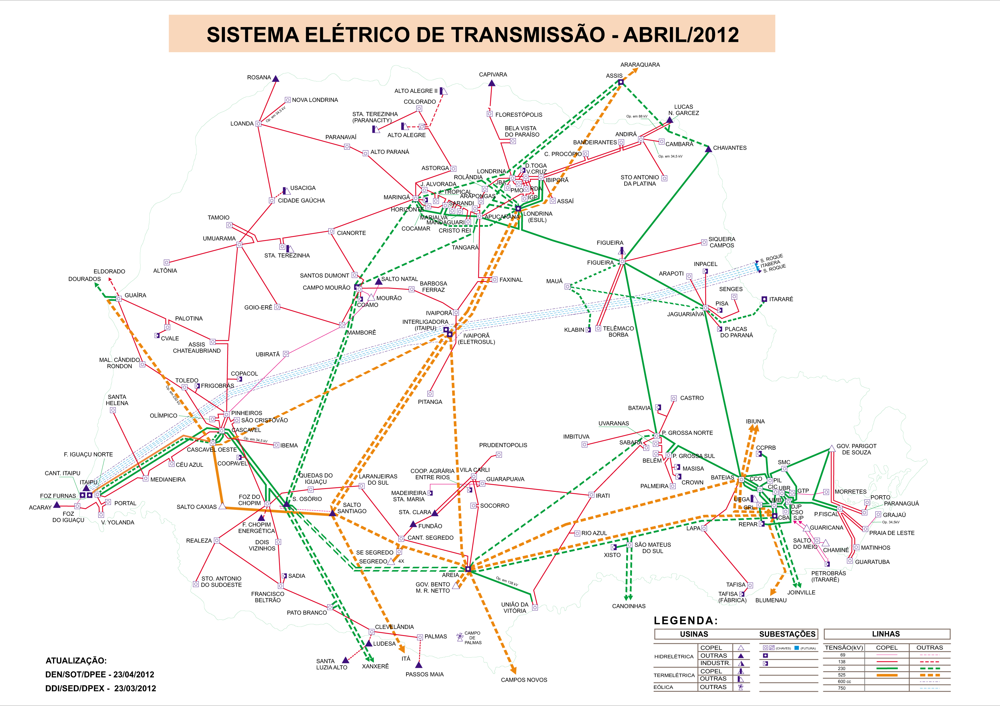
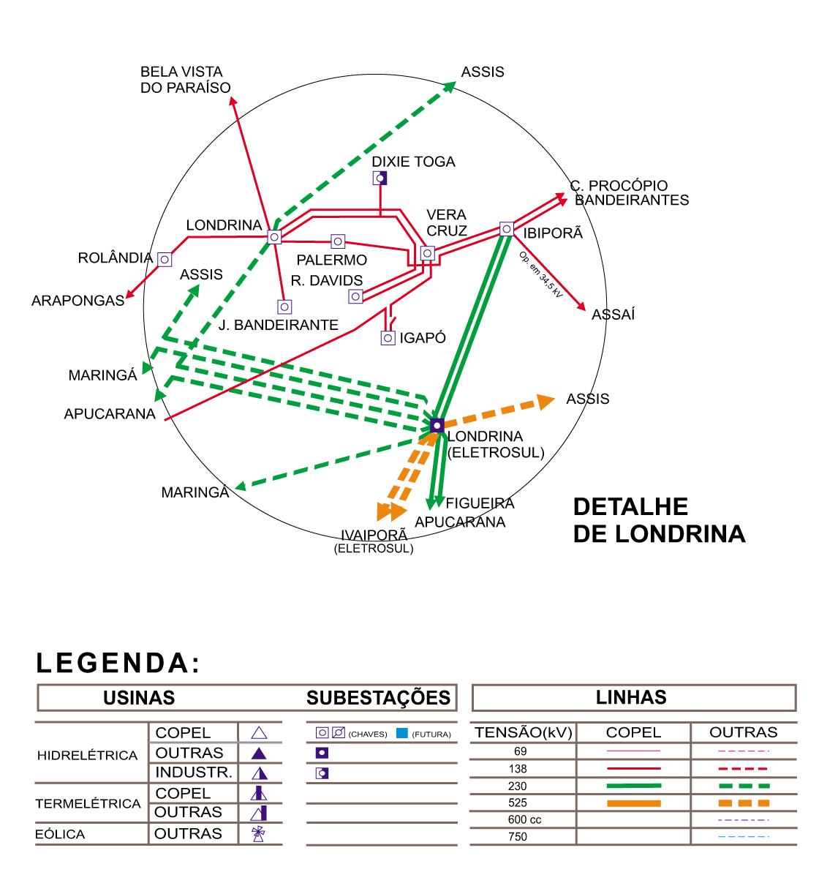
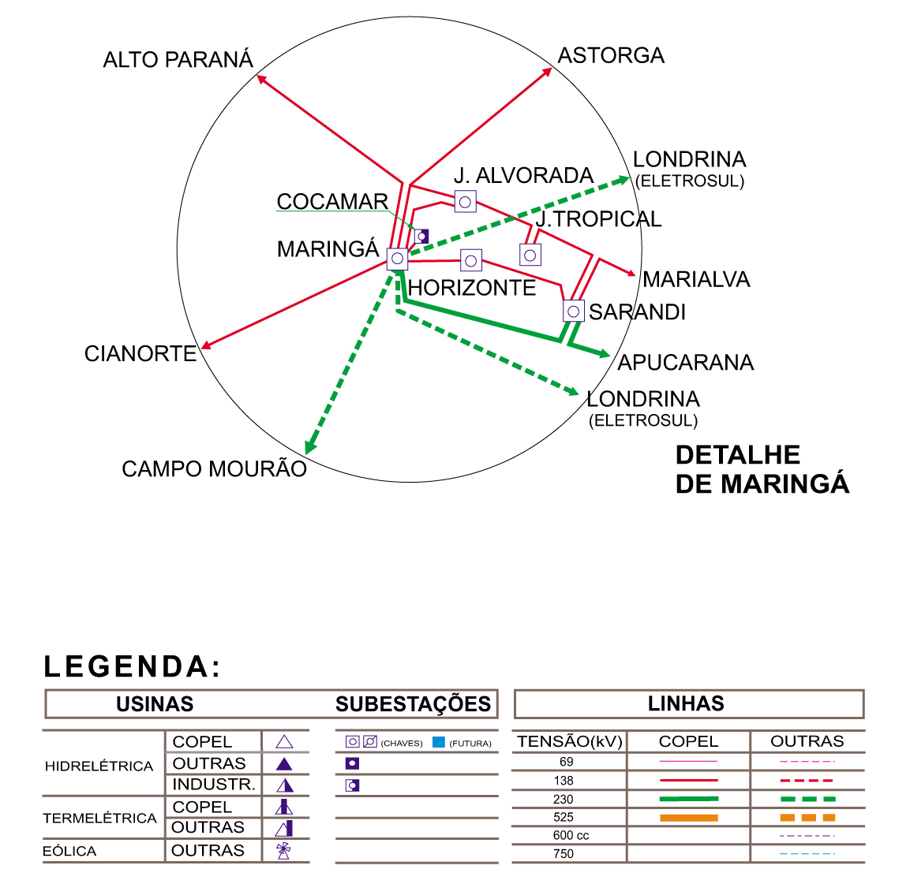
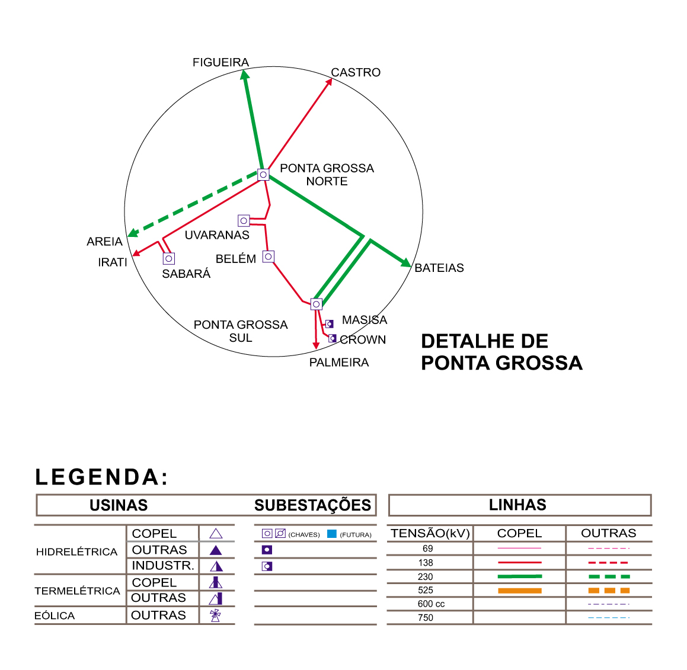
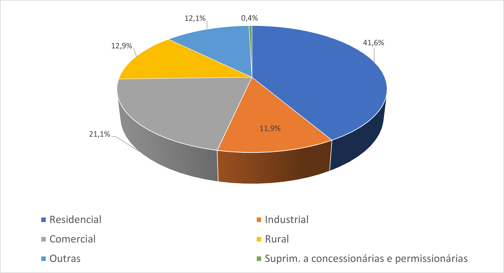

# Estudo de caso

Iniciamos, agora, o estudo do caso propriamente dito -- sendo este o da Companhia Paranaense de Energia. Para um estudo próprio de *valuation*, é necessário conhecer-se o ativo a ser estudado. Isso com a finalidade de poder realizar estimativas de crescimento e risco mais apropriadas, assim como realizar um pequeno dossiê da empresa e suas conquistas, elucidando assim práticas de governança e um histórico operacional.

## Breve dossiê da Copel

Comecemos, desta forma, fazendo um dossiê da empresa, de forma a estudar melhor sua história e operações, assim como expor casos relevantes da empresa.

### História

É de suma importância comentar que a parte a seguir é uma adaptação de transcritos oriundos do site da própria empresa,[^histCopel] com pequenos acréscimos por parte do autor.

[^histCopel]: Versão completa disponível em: <https://www.Copel.com/hpCopel/root/nivel2.jsp?endereco=%2FhpCopel%2Froot%2FpagCopel2.nsf%2Fdocs%2F6505401715872FAA032573FA0069734F>. Último acesso em 10 nov 2020.

A Companhia Paranaense de Energia é a maior empresa do estado do Paraná, tendo sido criada em 26 de outubro de 1954, sob controle acionário do estado do Paraná, abrindo seu capital acionário em abril de 1994 na BM&FBovespa, e tornou-se em julho de 1997 a primeira do setor elétrico brasileiro a ser listada na Bolsa de Valores de Nova Iorque. A marca está também presente, desde junho de 2002, na Comunidade Econômica Europeia, pela Latibex -- o setor latinoamericano da Bolsa de Valores de Madri. A partir de 7 de maio de 2008, a empresa também passou a figurar oficialmente no Nível 1 de Governança Corporativa da BM&FBovespa.

Em 2017, a Companhia atendia diretamente a mais de 4,5 milhões de unidades consumidoras em quase 400 municípios e 1.113 localidades paranaenses. Nesse universo incluem-se 3,6 milhões de lares, 78 mil indústrias, 384 mil estabelecimentos comerciais e 356 mil propriedades rurais. O quadro de pessoal, na época, era integrado por 8.453 empregados.

Sua estrutura compreende a operação de:

-   Parque gerador próprio composto por 30 usinas próprias e 11 participações, cuja potência instalada totaliza 5.675 MW -- a maior parte proveniente de fontes renováveis como hídrica e eólica -- e que responde pela produção de aproximadamente 4% de toda a eletricidade gerada no Brasil.
-   Sistema de transmissão formado por mais de 4 mil km de linhas e 45 subestações automatizadas.
-   Sistema de distribuição com 195 mil km de linhas -- a terceira maior do País -- e 362 subestações automatizadas.

Hoje as usinas, linhas de transmissão e de distribuição da Copel transmitem luz para todo o Paraná e estados vizinhos. Tal cenário de progresso tem sido conquistado ao longo de seis décadas, com base no potencial hidráulico e no domínio tecnológico de seus quadros técnicos e profissionais.

Comentaremos, agora, uma breve linha do tempo da Companhia.

Foi criada a Copel -- ainda Companhia Paranaense de Energia Elétrica -- através do Decreto n° 14.947 de 26 de outubro de 1954, assinado por Bento Munhoz da Rocha Neto, na época governador do Paraná. Apenas em 1979 tornou-se Companhia Paranaense de Energia, tendo como base principal para a integralização de seu capital o Fundo Estadual de Eletrificação. Em seguida, em 1956, com o Decreto n° 1.412, a Copel passou a centralizar todas as ações governamentais de planejamento, construção e exploração dos sistemas de produção, transmissão, transformação, distribuição e comércio de energia elétrica e serviços correlatos, tendo incorporado, de forma central, todos os bens, serviços e obras em poder de diversos órgãos. Coube à Companhia, então, ser responsável pela construção dos grandes sistemas de integração enerética e dos empreendimentos hidrelétricos previstos no Plano de Eletrificação do Paraná. Inclusive, no mesmo ano, em 1° de agosto, a Companhia assumiu pela primeira vez o serviço de distribuição de energia de um município do estado: Maringá. Na época, Maringá possuía um rápido crescimento demográfico. Ora, com a chegada da Copel e da energia elétrica, o desenvolvimento do município acelerou ainda mais. Em seguida, vieram outros municípios.

Durante a década de 60 e 70, pode-se constatar que o maior desafio para a Copel foi encontrar uma solução definitiva para o abastecimento de energia elétrica em larga escala. De fato, iniciaram-se as operações em 1963 da Usina Termelétrica de Figueira, de fundamental importância para a implantação do Plano Estadual de Eletrificação, viabilizando os sistemas de interligação que beneficiam as Regiões Norte e Centro. Quatro anos depois, a Copel inaugurou a Usina de Salto Grande do Iguaçu, para atender ao sul do Estado. Entrando na década de 70, entrava em operação a Usina Julio de Mesquita Filho, para abastecer energeticamente o oeste e o sudoeste. Um ano após, foi inaugurada a Usina Governador Parigot de Souza, este nome sendo uma homenagem ao governador Pedro Viriato Parigot de Souza, que também tinha sido presidente da Copel. É, atualmente, a maior central subterrânea do sul do Brasil e era a principal unidade geradora da Copel e maior usina em funcionamento no sul do Brasil no momento de sua inauguração, sendo um passo definitivo na constituição de uma infraestrutura energética capaz de suportar o desenvolvimento paranaense.

Nos anos de 1973 e 1974, a Copel deu um salto no número de consumidores ao assumir a distribuição de energia de diversos municípios do Estado. Em 1° de agosto de 1973, a Companhia incorporou a Companhia Força e Luz do Paraná, que atendia Curitiba. Um ano após, em 1° de junho de 1974, a Copel assumiu, também, a distribuição de Londrina. Aliado a isso, foi lançado um programa de inclusão elétrica pela empresa, o que contribuiu para levar energia a ainda mais residências. Dessa forma, tivemos em 1981 a marca de 1 milhão de consumidores ligados à rede.

Naturalmente, com tamanha expansão de clientela, seria necessário à empresa expandir sua capacidade energética. Dessa forma, em 1980 foi inaugurada a hidrelétrica Governador Bento Munhoz da Rocha Netto, nomeada em honra ao governador Bento Munhoz da Rocha Netto, governador este que assinou o Decreto para a criação da Companhia. Com essa operação, a geração própria da Copel atingiu 2.9 bi kWh, contra 1.9 bi kWh do ano anterior.

1986 foi um ano de retrospectiva para a Companhia. De fato, ela levou 27 anos (de 1954 a 1981) para alcançar 1 milhão de consumidores, e somente 5 anos para aumentar outros 500 mil. Essa conquista, inclusive, se deu em meio ao racionamento de energia por causa de uma estiagem forte na região. Assim sendo, as décadas seguintes são marcadas por uma expansão exponencial da empresa, assim como um aumento das obras para se expandir a capacidade energética.

Em setembro de 1992, foi concluída a Usina Hidrelétrica Governador Ney Aminthas de Barros Braga. Contribuiu para reduzir a dependência paranaense de energia comprada de outros Estados. Foi, inclusive, a primeira usina hidrelétrica a ter um Relatório de Impacto Ambiental (RIMA). Em fevereiro de 1999, entra em operação a Usina Hidrelétrica Governador José Richa.

Em 2004, a Copel completou 50 anos de existência. Apenas dois anos antes, foi anunciado o cancelamento do processo de privatização da Companhia, iniciado em 1998. Com o passar dos anos, a empresa se tornou expoente no que tange a P&D do setor elétrico, com diversas inovações. Nota-se, por exemplo, o marco do funcionamento da primeira célula a combustível a operar no Hemisfério Sul, em 2001, para suprir o CPD da Copel. Houve também a automação da subestação Jardim Tropical, fazendo com que a empresa sae tornasse a primeira do setor elétrico brasileiro a automatizar todas as subestações de transmissão.

A empresa inaugura, em 2 anos, 2 novas hidrelétricas: a de Santa Clara e a do Fundão. No meio tempo da construção de outra usina, ambas Santa Clara e Fundão recebem autorização da ONU e tornam-se as primeiras hidrelétricas do Brasil a poderem comercializar certificados de Créditos de Carbono. De fato, existem duas outras usinas com planos de construção, a de Mauá e a Colíder, demonstrando assim a demanda de expansão da Companhia.

Em 2012, a Copel finalizou todas as fases do programa Luz para Todos, efetivamente conquistando a universalização do fornecimento de energia elétrica no Paraná. O reconhecimento foi formalizado pela ANEEL, marcando assim o início de uma era sob motivação de modernização e automação das redes de energia por parte da empresa. Três anos após, em janeiro, a Copel institui uma empresa de comercialização para atuar no Mercado Livre, atuando assim na compra e venda de energia, além de consultoria. A partir de 2016, a empresa volta seus esforços para além do Paraná, com entradas de operação em linhas de transmissão que conectam o Paraná ao Mato Grosso e um no Maranhão.

Podemos notar, então, um grau de maturidade elevado por parte da empresa atualmente, em que a mesma segue uma motivação de melhoria dos processos atuais, com objetivo secundário de ampliar para outros estados, à medida que concessões e órgãos reguladores dão seu aval.

### *Core business*

As informações retiradas para o estudo do *core business* da Copel foram retiradas diretamente do site deles.[^siteCopel]

[^siteCopel]: Disponível em: <https://www.Copel.com/hpcweb/>. Último acesso em 20 nov 2020.

#### Geração

A Copel opera um parque gerador com diversas usinas próprias e participações societárias, em um leque diversificado de fontes energéticas, indo de biomassa a solar. A geração é supervisionada e coordenada pelo Centro de Operação de Geração e Transmissão da empresa, sediado em Curitiba.

```{r, fig.cap = "Usinas da Copel localizadas em mapa do Paraná.", fig.pos = "H", echo = FALSE, out.width = "100%"}
knitr::include_graphics("img/usinas_Copel.jpg")
```

Comecemos comentando a respeito das hidrelétricas. Existe uma diferenciação entre Central Geradora Hidrelétrica (CGH), Pequena Central Hidrelétrica (PCH) e Usina Hidrelétrica (UHE). Por mais que todas se aproveitem do potencial hidráulico de um recurso hídrico, a diferença está no porte do empreendimento. Como disposto pela ANEEL, na Resolução n° 875, de 10 de março de 2020,[^res875] a diferenciação é tal:

[^res875]: Disponível em: <https://www.in.gov.br/web/dou/-/resolucao-normativa-n-875-de-10-de-marco-de-2020-248070610>. Último acesso em 17 nov 2020.

-   Uma **Central Geradora Hidrelétrica com Capacidade Instalada Reduzida (CGH)** é aquela cuja potência seja igual ou inferior a 5 MW.
-   Uma **Pequena Central Hidrelétrica (PCH)** é aquela que possui duas características: (1) potência instalada superior a 5 MW e igual ou inferior a 30 MW; e (2) área de reservatório de até 13 km², excluindo a calha do leito regular do rio. Existem, ainda, cláusulas que regularizam a condição de (2).
-   Uma **Usina Hidrelétrica (UHE)** é aquela que possui quaisquer uma das seguintes características: (1) potência instalada superior a 5 MW e igual ou inferior a 50 MW, desde que não sejam enquadrados como PCH e estejam sujeitos à outorga de autorização; (2) potência instalada superior a 50 MW, sujeitos à outorga de concessão; ou (3) independente da potência instalada, tenham sido objeto de outorga de concessão ou de autorização.

Essa diferenciação é relevante, uma vez que o licenciamento destes três tipos de empreendimento ocorre de forma diferenciada. Isso decorre do fato que a extensão dos impactos ambientais provocados pelas CGHs, PCHs e UHEs são, também, diferenciados.

Assim sendo, são as hidrelétricas tanto operacionais quanto em construção, com participação da Copel:

-   **UHE Colíder.** Está sendo construída na região norte do Mato Grosso, nos municípios de Nova Canaã do Norte e Itaúba. O empreendimento terá potência instalada estimada de 300 MW, o suficiente para atender ao consumo de uma cidade com 850 mil habitantes. Cabe comentar que essa obra é integrante do PAC do Governo Federal.
-   **UHE Governador Ney Aminthas de Barros Braga,** anterior UHE Segredo. Esta é a segunda usina da Copel em potência instalada, com capacidade de 1.260 MW. Está localizada no rio Iguaçu, no município de Mangueirinha. Foi inaugurada em 1992, tendo sido a primeira UHE a possuir um Relatório de Impacto Ambiental (Rima) no Brasil.
-   **UHE Governador José Richa,** anterior UHE Salto Caxias. É uma das mais importantes da Copel, tendo 1.240 MW de potência instalada. Foi inaugurada em fevereiro de 1999 e está situada no rio Iguaçu, no município de Capitão Leônidas Marques.
-   **UHE Governador Bento Munhoz da Rocha Netto,** anterior UHE Foz do Areia. Esta é a maior usina da Copel, com capacidade instalada de 1.676 MW. Está localizada no rio Iguaçu, no município de Pinhão. Como um todo, a operação foi iniciada em 1980; suas operações causaram a desativação da PCH Salto Grande do Iguaçu, que contava com 15.2 MW.
-   **UHE Baixo Iguaçu.** Tem capacidade instalada de 350,2 MW -- suficiente para atender uam cidade com 1 milhão de habitantes. Iniciou suas operações no primeiro semestre de 2019. A Copel detém 30% de participação nesta usina instalada no rio Iguaçu, entre os municípios de Capanema e Capitão Leônidas Marques.
-   **UHE Governador Pedro Viriato Parigot de Souza,** anterior UHE Capivari-Cachoeira. Possui potência de 260 MW, estando situada no município de Antonina, com reservatório localizado no município de Campina Grande do Sul. Entrou em operação em 1970, embora tenha sido inaugurada oficialmente em 26 de janeiro de 1971. Ela é a maior central subterrânea do sul do país.
-   **UHE Dona Francisca.** Com potência instalada de 125 MW, a Copel detém participação de 23,03% no capital social da Dona Francisca Energética S/A (Dfesa). Foi inaugurada em maio de 2001.
-   **UHE Santa Clara.** Tem potência instalada de 120 MW, com garantia física de 69,6 MW médios. Está localizada entre os municípios de Candói e Pinhão, no rio Jordão. Conta, ainda, com uma PCH de potência 3,6 MW e garantia de 2,79 MW médios.
-   **UHE Fundão.** Possui potência instalada de 120 MW, com garantia física de 65,8 MW médios. Está localizada próximo ao município de Pinhão. Conta, ainda, com uma PCH de potência 2,5 MW e garantia de 2,11 MW médios.
-   **UHE Guaricana.** Possui potência de 36 MW. Localize-se na margem esquerda do rio Arraial, no município de Guaratuba. A usina foi adquirida pela Copel quando houve a incorporação da Cia. Força e Luz do Paraná, embora tenha sido inaugurada em 1957.
-   **UHE Derivação do Rio Jordão.** Foi inaugurada em dezembro de 1997, com potência de 6,5 MW. Está localizada no município de Reserva do Iguaçu.
-   **PCH São Jorge.** Possui capacidade instalada de 2,3 MW e está localizada à margem esquerda do rio Pitangui, numa região denominada Alagados. A usina foi inaugurada em 1945, na época pertencendo à Companhia Prada de Eletricidade S.A.; apenas em dezembro de 1974 foi incorporada pela Copel.
-   **PCH Apucaraninha.** Tem capacidade instalada de 10 MW. Foi inaugurada em 1949, pela Empresa Elétrica de Londrina S.A., e incorporada pela Copel em 1974. Está localizada no município de Tamarana, na margem direita do rio Apucaraninha.
-   **PCH Arturo Andreoli,** também conhecida como PCH Foz do Chopim. A Copel detém 35,77% de participação societária da Foz do Chopim Energética Ltda., empresa constituída para exploração da PCH. Tem potência total instalada de 29,1 MW, e a usina como um todo entrou em operação comercial em novembro de 2001.
-   **PCH Chaminé.** Possui capacidade instalada de 18 MW, e está localizada na margem esquerda do rio São João, no município de São José dos Pinhais. Foi construída pela Cia. Força e Luz do Paraná, começando a operar em 1930. Foi incorporada pela Copel em 1975.
-   **PCH Cavernoso.** Esta possui a potência de 1,3 MW. Está localizada na margem direita do rio Cavernoso no município de Virmond. Interessantemente, ela opera a fio d'água, significando que a geração é feita apenas através da vazão normal do rio. Foi construída no final da década de 50 pelo DNAEE e pela prefeitura de Laranjeiras do Sul; entretanto foi inaugurada em 1965, quando foi incorporada pela Copel e teve sua capacidade ampliada.
-   **PCH Cavernoso II.** Tem capacidade instalada de 19 MW, com garantia física de 10,6 MW médio. Foi construída no rio Cavernoso, entre os municípios de Virmond e Candói. A Central entrou em operação comercial a plena capacidade em 4 de julho de 2013.
-   **PCH Chopim I.** Tem potência instalada de 1,98 MW e está localizada na margem esquerda do rio Chopim, no município de Itapejara d'Oeste. Foi a primeira usina construída pela Copel, durante a concepção do primeiro plano de eletrificação do Paraná. A operação começou em 1963.
-   **PCH Bela Vista.** Está sendo instalada no rio Chopim, entre os municípios de Verê e São João, no sudoeste paranaense. O empreendimento recebeu do Instituto Ambiental do Paraná a Licença de Instalação nº 23.569, no dia 10 de maio de 2019. Quando estiver pronta, Bela Vista terá potência instalada de 29 MW e produzirá energia elétrica suficiente para atender até 100 mil pessoas.
-   **CGH Salto do Vau.** Possui potência instalada de 0.94 MW e está localizada na margem esquerda do rio Palmital, no município de União da Vitória. Foi inaugurada em 1959, quando começou a operar. Foi construída pela empresa Alexandre Schlemm e incorporada pela Copel em novembro de 1973.
-   **CGH Pitangui.** Possui 0,87 MW de potência e está localizada na margem esquerda do rio Pitangui, a 12 km de Ponta Grossa. Foi construída por outra empresa em 1911, mas finalmente incorporada pela Copel em 1974.
-   **CGH Melissa.** Possui capacidade de 1 MW de potência instalada e situa-se no município de Corbélia, à margem direita do rio Melissa. Efetivamente, sua operação iniciou-se em 1969, embora tenha sido pausada para uma reforma geral durante a implantação dos equipamentos que a tornaram automatizada em 1994. Retomou, então, a operação no segundo semestre de 1995.
-   **CGH Marumbi.** Possui uma capacidade de 4,8 MW de potência em duas unidades geradoras, e está localizada no município de Morretes, à margem direita do rio Ipiranga. Foi inaugurada em abril de 1961, construída pela RFFSA. Em razão do Plano Nacional de Desestatização, por não se enquadrar nas atividades da RFFSA, a usina foi adquirida pela Copel em novembro de 1997.

No que tange a usinas termelétricas, a Copel possui:

-   **UTE Figueira.** Conta com capacidade instalada de 20 MW, e funciona a base carvão mineral extraído em jazidas da região. A aquisição da usina foi feita pela Copel em 1969, com posterior instalação de um terceiro grupo gerador, em 1974.
-   **UTE Araucária.** Com capacidade instalada de 484,5 MW, se faz valer de um ciclo combinado de turbina a gás/turbina a vapor para dispor energia. A usina entrou em operação em 2006 para atender ao SIN, em face da severa estiagem ocorrida no início do segundo semestre do ano.

Vale comentar, entretanto, que a capacidade instalada das UTEs não deve ser tratada como algo sob "uso constante", como é o caso de UHEs, por exemplo. De fato, as UTEs servem atualmente mais como um mecanismo de segurança do sistema energético do que um método de produção regular, pelo alto custo da energia, assim como os problemas relativos à poluição e gases do efeito estufa [@rosa2007].

Finalmente, no que tange a energia eólica, a Copel conta com:

-   **EOL Palmas.** É composta por cinco aerogeradores de 500 kW cada, totalizando assim 2,5 MW de potência instalada. Está situada no município de Palmas, ao sul do Paraná. Foi a primeira eólica da região sul do Brasil. Entrou em operação em fevereiro de 1999, mas apenas em 2008 a Copel deteve adquiriu total controle da empresa responsável pela usina, a Centrais Eólicas do Paraná.
-   **Complexo Eólico São Bento Energia.** Está localizado nos municípios de Pedra Grande e São Bento do Norte -- no Rio Grande do Norte. Tem 94 MW de potência instalada.
-   **Complexo Eólico Brisa Potiguar.** Está localizado nos municípios de Parazinho, João Câmara e Touros -- no Rio Grande do Norte. Tem 183,6 MW de potência instalada.
-   **Complexo Eólico Cutia.** Está localizado nos municípios de Pedra Grande e São Bento do Norte -- no Rio Grande do Norte. Tem 180,6 MW de potência instalada.
-   **Complexo Eólico Bento Miguel.** Está localizado no município de São Bento do Norte -- no Rio Grande do Norte. Tem 132,3 MW de potência instalada.
-   **Complexo Eólico Voltalia.** Está localizado nos municípios de São Miguel do Gostoso e Touros -- no Rio Grande do Norte. Conta com 108 MW de potência instalada.

Assim sendo, é possível observar que a matriz energética da Copel é diversificada com maior ênfase em hidrelétricas, com recentes desenvolvimentos na construção de parques eólicos, de forma a se aproveitar de Créditos de Carbono e uma fronte de energias mais limpas.

#### Transmissão

Como uma *holding*, a Copel também está presente no setor de transmissão de energia elétrica. De fato, referente a junho de 2016, a Copel possuía 2.521,2 km de linhas e 35 subestações, somando 13.002 MVA de potência de transformação.

As tabelas abaixo apresentam o dimensionamento dos ativos de transmissão da Copel relativos à Rede Básica, para o período de junho de 2016. Cabe comentar que todas as subestações são inteiramente automatizadas.

```{r, tab.pos = "H", echo = FALSE, message = FALSE}
library(tidyverse)
library(knitr)
library(kableExtra)

kable(
  tibble(
    `NÍVEL DE TENSÃO (kV)` = c(69, 138, 230, 525),
    `EXTENSÃO (km)` = c(0, 7.2, 2235.5, 278.5)
  ),
  caption = "Extensão de linhas de transmissão da Copel, por nível de tensão.",
  format = "latex",
  booktabs = TRUE,
  align = "cc"
  ) %>%
  kable_styling(
    latex_options = "HOLD_position"
  ) %>%
  add_header_above(
    header = c("LINHAS DE TRANSMISSÃO" = 2),
    bold = TRUE
  )
```

```{r, tab.pos = "H", echo = FALSE, message = FALSE}
library(tidyverse)
library(knitr)
library(kableExtra)

kable(
  tibble(
    `NÍVEL DE TENSÃO (kV)` = c(230, 525),
    `QUANTIDADE` = c(31, 4),
    `POTÊNCIA (MVA)` = c(9602.0, 3400.0)
  ),
  caption = "Subestações de transmissão da Copel, por nível de tensão.",
  format = "latex",
  booktabs = TRUE,
  align = "ccc"
  ) %>%
  kable_styling(
    latex_options = "HOLD_position"
  ) %>%
  add_header_above(
    header = c("SUBESTAÇÕES DE TRANSMISSÃO" = 3),
    bold = TRUE
  )
```

<!--
Essa coisa eh so pra dar o espaco e a formatacao voltar ao normal
-->
$\,$

É possível, também, observar essa extensão geograficamente, através de mapas geoelétricos do estado do Paraná e as principais regiões, como Curitiba e Londrina.

```{r, fig.cap = "Mapa geoelétrico do Paraná.", fig.pos = "H", echo = FALSE, out.width = "100%"}

```

```{r, fig.cap = "Mapa geoelétrico de Curitiba.", fig.pos = "H", echo = FALSE, out.width = "100%"}
knitr::include_graphics("img/mapa_geoeletrico_curitiba.jpg")
```

```{r, fig.cap = "Mapa geoelétrico de Londrina.", fig.pos = "H", echo = FALSE, out.width = "100%"}

```

```{r, fig.cap = "Mapa geoelétrico de Maringá.", fig.pos = "H", echo = FALSE, out.width = "100%"}

```

```{r, fig.cap = "Mapa geoelétrico de Ponta Grossa.", fig.pos = "H", echo = FALSE, out.width = "100%"}

```

Por mais que a Companhia possua projetos de transmissão em andamento -- como, por exemplo, as LT Baixo Iguaçu - Realeza e Londrina - Assis --, ela também atua em consultoria e engenharia de linhas de transmissão e subestações. De fato, a engenharia de linhas de transmissão da Copel é certificada pela ISO 9001 e atua em seminários, comitês técnicos, treinamentos e pesquisas em áreas avançadas. A experiência da empresa no setor foi utilizada em cerca de 7,6 mil km de linhas, implantadas com baixo custo e alta qualidade. A rede básica da empresa, no final das contas, conta com aproximadamente 5,4 mil km de cabos para-raios com fibras óticas -- de tecnologia OPGW, _Optical Ground Wire._ Relativo à engenharia de subestações, a Copel elabora projetos de subestações nas tensões de 69, 138, 230 e 525 kV; gerencia projetos de subestações, elabora especificações de materiais e equipamentos para subestações, dimensiona sistemas de aterramento, gerencia a construção; e calcula custos e realiza orçamentos para subestações.

#### Distribuição

No que tange a distribuição, a Copel é responsável pela energia de cerca de 4,5 milhões de clientes de 394 municípios do Paraná -- sendo 392 integralmente atendidos e 2 parcialmente. A empresa administra 190 mil km de redes de distribuição, com 2,8 milhões de postes e 361 subestações, assim como potência instalada de 10,5 mil MVA. Todos os dados são referentes ao final do ano de 2019. A empresa conta, também, com postos de atendimento espalhados por todos os municípios da área de concessão.

```{r, tab.pos = "H", echo = FALSE, message = FALSE}
library(tidyverse)
library(knitr)
library(kableExtra)

kable(
  tibble(
    `Classes` = c("Residencial", "Industrial", "Comercial", "Rural", "Outras"),
    `set-19` = c(3808, 73, 405, 351, 58),
    `set-18` = c(3732, 74, 397, 353, 57),
    `%` = c(2.0, -1.4, 2.1, -0.6, 1.2)
  ),
  caption = "Número de consumidores da Copel.",
  format = "latex",
  booktabs = TRUE,
  align = "cccc"
  ) %>%
  kable_styling(
    latex_options = "HOLD_position"
  ) %>%
  add_header_above(
    header = c("Número de consumidores (em milhares)" = 1, "No mês" = 3)
  )
```

```{r, tab.pos = "H", echo = FALSE, message = FALSE}
library(tidyverse)
library(knitr)
library(kableExtra)

kable(
  tibble(
    " " = c("Área de Concessão (km²)", "Municípios Atendidos", "Localidades Atendidas", "População Atendida PR (Mil Habitantes)", "Taxa de Atendimento Urbana (%)", "Consumo Médio Residencial (kWh/mês)"),
    "set/19" = c(194854, 393, 113, 11434, 99.9, 167.5)
  ),
  caption = "Indicadores de atuação da distribuição.",
  format = "latex",
  booktabs = TRUE,
  align = "cc"
  ) %>%
  kable_styling(
    latex_options = "HOLD_position"
  )
```

O perfil de consumo de energia da empresa é diversificado, com a classe Industrial sendo a maior de todas as fatias.

```{r, tab.pos = "H", echo = FALSE, message = FALSE}
library(tidyverse)
library(knitr)
library(kableExtra)

kable(
  tibble(
    `Classes` = c("Residencial", "Industrial", "Comercial", "Rural", "Outras", "Suprim. a Concessionárias e Permissionárias", "Concessionárias Fio"),
    `set-19` = c(5571, 8451, 4509, 1817, 1895, 146, 483),
    `set-18` = c(5413, 8422, 4330, 1791, 1856, 222, 369),
    `%` = c(2.9, 0.3, 4.1, 1.5, 2.1, -34.5, 30.9)
  ),
  caption = "Perfil de consumo de energia da distribuição.",
  format = "latex",
  booktabs = TRUE,
  align = "cccc"
  ) %>%
  kable_styling(
    latex_options = "HOLD_position"
  ) %>%
  add_header_above(
    header = c("Consumo de Energia Acumulado - GWh" = 4),
    bold = TRUE
  )
```

```{r, fig.cap = "Gráfico dos perfis de consumo da distribuição.", fig.pos = "H", echo = FALSE, out.width = "100%"}

```

Dentro da classe Industrial, temos ainda subdivisões por atividade, com a fabricação de celulose e alimentos compondo quase metade do consumo como um todo.

```{r, tab.pos = "H", echo = FALSE, message = FALSE}
library(tidyverse)
library(knitr)
library(kableExtra)

kable(
  tibble(
    `Descrição` = c("Fabricação de Produtos Alimentícios", "Fabricação de Celulose, Papel e Produtos de Papel", "Fabricação de Produtos Minerais Não Metálicos", "Fabricação de Produtos de Borracha e de Material Plástico", "Fabricação de Produtos Químicos", "Demais Ramos"),
    `set-19` = c(2840, 1113, 615, 510, 491, 2882),
    `set-18` = c(2715, 1181, 716, 492, 443, 2875),
    `%` = c(4.6, -5.8, -14.1, 3.6, 11.1, 0.2)
  ),
  caption = "Perfil de consumo de energia da classe Industrial.",
  format = "latex",
  booktabs = TRUE,
  align = "cccc"
  ) %>%
  kable_styling(
    latex_options = "HOLD_position"
  ) %>%
  add_header_above(
    header = c("Consumo de Energia Acumulado - GWh" = 4),
    bold = TRUE
  )
```

A Copel disponibiliza também os dados referentes às tarifas pagas pelos clientes, tanto de alta quanto baixa tensão.[^justTarifas]

[^justTarifas]: É importante ressaltar que as tarifas já estão disponibilizadas com os impostos (ICMS, PIS e COFINS), vigentes a partir de 09 jul 2020; foram incluídos para facilitar o entendimento por parte do leitor, no entanto, as alíquotas efetivas referentes ao PIS e à COFINS devem ser apuradas mensalmente, com suas variações sendo aplicadas às tarifas tempestivamente.

A empresa, naturalmente, se faz valer de uma Norma aplicável a conexão de micro e minigeração no sistema de compensação -- esta é a NTC 905200[^normaCopel]. Isso decorre do fato que conforme o estabelecido pela Resolução da ANEEL n° 482/2012,[^res482] é permitido aos consumidores instalar geradores de pequeno porte em suas unidades consumidoras e utilizar o sistema elétrico da distribuidora para injetar o excedente de energia, que é convertido em crédito de energia válido por 60 meses. Tais créditos poderão ser utilizados para abater do consumo da própria unidade consumidora nos meses seguintes ou de outras unidades consumidoras que precisam estar previamente cadastradas para esse fim e atendidas pela mesma distribuidora -- no caso, a Copel --, cujo titular seja o mesmo da unidade com sistema de compensação de energia elétrica, possuidor do mesmo CPF ou CNPJ junto ao Ministério da Fazenda. Outra forma para adicionar unidades consumidoras para o abatimento do consumo é através de empreendimento com múltiplas unidades consumidoras ou geração compartilhada.

[^normaCopel]: Disponível em: <https://bit.ly/35Ze9Xv>. Último acesso em 23 nov 2020.

[^res482]: Disponível em: <http://www.aneel.gov.br/cedoc/bren2012482.pdf>. Último acesso em 23 nov 2020.

## Cálculo do *valuation* intrínseco

Nesta seção, demonstraremos como se realiza o cálculo de *valuation* intrínseco utilizando-se os métodos citados anteriormente no referencial teórico. Antes, entretanto, cabem algumas observações relativas às demonstrações financeiras, assim como o estabelecimento de algumas bases para os estudos.

Para uma análise intrínseca, comecemos nos debruçando sobre as demonstrações financeiras da Companhia. Conforme recomendação de Graham e Dodd [-@graham2009], para uma estimativa do futuro, será usada uma janela de 10 anos. Os dados foram obtidos através do site Fundamentus.[^acessoFundamentus]

[^acessoFundamentus]: Disponível em: <https://www.fundamentus.com.br/balancos.php?papel=CPLE3&tipo=1>. Dados obtidos pela última vez em 23 mar 2021.

É relevante começar a análise pelo balanço patrimonial, uma vez que este demonstra os ativos e passivos da empresa como um todo; é similar a uma fotografia da situação da empresa ao final do período. Assim, é possível estudar o imobilizado da empresa, a condição de dívida e, posição de liquidez, dentre outros.

```{r, tab.pos = "H", echo = FALSE, message = FALSE, warning = FALSE}
library(readxl)
library(tidyverse)
library(lubridate)

bp <- read_excel("data/balCOPEL.xlsx", sheet = "Bal. Patrim.", skip = 1)

ordem <- bp[1] %>%
  rename(Conta = ...1) %>%
  mutate(temp = row_number()) %>%
  unite(Conta_nova, temp, Conta, sep = "_") %>%
  unlist() %>%
  as_factor() %>%
  factor(ordered = TRUE)

bp_trat <- bp %>%
  rename(Conta = ...1) %>%
  mutate(temp = row_number()) %>%
  unite(Conta_nova, temp, Conta, sep = "_") %>%
  pivot_longer(cols = 2:ncol(.), names_to = "Data", values_to = "Valor") %>%
  mutate(Data = dmy(Data),
         ano = year(Data)) %>%
  group_by(Conta_nova, ano) %>%
  summarise(Valor = first(Valor)) %>%
  ungroup() %>%
  pivot_wider(names_from = "ano", values_from = "Valor") %>%
  .[order(match(.$Conta_nova, ordem)),] %>%
  separate(col = "Conta_nova", into = c(NA, "Conta"), sep = "_") %>%
  select(-2) %>%
  drop_na() %>%
  mutate_at(2:ncol(.), round)

kable(bp_trat %>% select(1:6),
  caption = "Balanço Patrimonial da Copel, em milhares de reais. Base contábil de 2011 a 2015.",
  format = "latex",
  booktabs = TRUE,
  longtable = TRUE
  ) %>%
  kable_styling(
    latex_options = c("HOLD_position", "repeat_header"),
    repeat_header_text = "\\textit{(continuação)}",
    font_size = 8
  ) %>%
  column_spec(1, width = "6cm")

kable(bp_trat %>% select(1, 7:11),
  caption = "Balanço Patrimonial da Copel, em milhares de reais. Base contábil de 2016 a 2020.",
  format = "latex",
  booktabs = TRUE,
  longtable = TRUE
  ) %>%
  kable_styling(
    latex_options = c("HOLD_position", "repeat_header"),
    repeat_header_text = "\\textit{(continuação)}",
    font_size = 8
  ) %>%
  column_spec(1, width = "6cm")
 
```

É relevante comentar que, ao longo dos 10 anos, o patrimônio líquido da Copel não caiu de forma consolidada em qualquer ano; demonstra inclusive uma tendência de crescimento, estando 68,7% superior no ano de 2020, relativo a 2011. Isso pode ser expandido para as contas de ativos e passivos, o que é um indicador de estabilidade e previsibilidade de rendimentos.

Além disso, relativo ao controle da dívida em 2020, nota-se que a companhia tem aproximadamente 50% de dívida bruta, sendo este o valor total dos empréstimos e financiamentos – tanto circulantes quanto não-circulantes – dividido pelo patrimônio líquido.

No que tange à capacidade de pagamento, a empresa mantém a liquidez corrente – isto é, o ativo circulante dividido pelo passivo circulante – em níveis sadios, a 1,18; isso demonstra que a empresa consegue, facilmente, quitar suas obrigações de curto prazo, para o ano de 2021.

Vale comentar também a estrutura de capital no último ano do balanço, que é de aproximadamente 42,7% de capital próprio – faz-se a divisão do patrimônio líquido pelo passivo total – e 57,3% de capital de terceiros – o restante. Esses dados serão relevantes para se calcular o custo ponderado de capital mais tarde.


```{r, tab.pos = "H", echo = FALSE, message = FALSE, warning = FALSE}
library(readxl)
library(tidyverse)
library(lubridate)

dre <- read_xlsx("data/balCOPEL.xlsx", skip = 1, sheet = "Dem. Result.")

ordem <- dre[1] %>%
  rename(Conta = ...1) %>%
  mutate(temp = row_number()) %>%
  unite(Conta_nova, temp, Conta, sep = "_") %>%
  unlist() %>%
  as_factor() %>%
  factor(ordered = TRUE)

dre_trat <- dre %>%
  rename(Conta = ...1) %>%
  mutate(temp = row_number()) %>%
  unite(Conta_nova, temp, Conta, sep = "_") %>%
  pivot_longer(cols = 2:ncol(.), names_to = "Data", values_to = "Valor") %>%
  mutate(Data = dmy(Data),
         ano = year(Data)) %>%
  group_by(Conta_nova, ano) %>%
  summarise(Valor = sum(Valor)) %>%
  ungroup() %>%
  pivot_wider(names_from = "ano", values_from = "Valor") %>%
  .[order(match(.$Conta_nova, ordem)),] %>%
  separate(col = "Conta_nova", into = c(NA, "Conta"), sep = "_") %>%
  select(-2) %>%
  drop_na() %>%
  mutate_at(2:ncol(.), round)

kable(dre_trat %>% select(1:6),
  caption = "Demonstrativos de Resultado da Copel, em milhares de reais. Base contábil de 2011 a 2015.",
  format = "latex",
  booktabs = TRUE,
  longtable = TRUE
  ) %>%
  kable_styling(
    latex_options = c("HOLD_position", "repeat_header"),
    repeat_header_text = "\\textit{(continuação)}",
    font_size = 8
  )

kable(dre_trat %>% select(1, 7:11),
  caption = "Demonstrativos de Resultado da Copel, em milhares de reais. Base contábil de 2016 a 2020.",
  format = "latex",
  booktabs = TRUE,
  longtable = TRUE
  ) %>%
  kable_styling(
    latex_options = c("HOLD_position", "repeat_header"),
    repeat_header_text = "\\textit{(continuação)}",
    font_size = 8
  )

```

No que tange ao demonstrativo de resultado, é notável a crescente na receita líquida, demonstrando em conjunto com o crescimento da base de consumidores, um aumento na arrecadação por cliente. De fato, relativo a 2011, o último ano contou com um crescimento de 139,6%.

Salta aos olhos, entretanto, algumas irregularidades no que tange ao lucro líquido do ano de 2020. Ora, sendo esta uma companhia que funciona em sua maioria à base de concessões, qual a razão para tal flutuação?

Grande parte é por causa do resultado financeiro, associado a um reconhecimento de crédito tributário, assim como juros e variação monetária sobre repasse do CRC – a Conta de Resultados a Compensar. Evidentemente, existe também um crescimento de receita líquida obtida por parte dos clientes, entretanto isso é de se esperar por parte de empresas operando com base em concessões.

```{r, tab.pos = "H", echo = FALSE, message = FALSE, warning = FALSE}
library(readxl)
library(tidyverse)

dfc <- read_csv2("data/DFC_Copel.csv") %>%
  select(-2) %>%
  rename("Conta" = "Detalhamento",
         "2020" = "31/12/2020",
         "2019" = "31/12/2019",
         "2018" = "31/12/2018",
         "2017" = "31/12/2017") %>%
  relocate("2019", .after = "Conta") %>%
  relocate("2018", .after = "Conta") %>%
  relocate("2017", .after = "Conta") %>%
  mutate_at(2:ncol(.), function(x) replace_na(x, "-") %>% str_replace("-", " "))

kable(dfc,
  caption = "Demonstrativos de Fluxo de Caixa da Copel, em milhares de reais. Base contábil de 2017 a 2020.",
  format = "latex",
  booktabs = TRUE,
  longtable = TRUE
  ) %>%
  kable_styling(
    latex_options = c("HOLD_position", "repeat_header"),
    repeat_header_text = "\\textit{(continuação)}",
    font_size = 8
  )
```

O DFC não está apresentado desde 2011 por causa das possíveis mutações dentro da nomenclatura das contas, assim como ser de uso mais pontual, para calcular o fluxo de caixa livre.

### *Valuation* através de Fluxos de Caixa Descontados (DCF)

Conforme comentado no preâmbulo anterior, é razoável supor que esse crescimento de lucro líquido no DRE – mais de 100%, comparando 2020 a 2019 – não é sustentável. De fato, é de se esperar que esse lucro caia em 2021. Dessa forma, pressupõe-se um valor de EBIT de 3.1 bilhões de reais para o ano de 2021.

Relativo à taxa de crescimento do EBIT, de 1.36 bilhões de reais em 2011, para 3.1 bilhões de reais em 2021, temos uma taxa de crescimento de aproximadamente 7.8% a.a.

No que tange à sensibilidade do ativo perante o mercado, através de uma visita ao Yahoo! Finance[^BetaCPLE], temos que $\beta$ vale 0.66. Este foi calculado através de base mensal com duração de 5 anos.

[^BetaCPLE]: Disponível em: <https://finance.yahoo.com/quote/CPLE3.SA/>. Último acesso em 27 abr 2021.

A seguir, os componentes para o cálculo de CAPM. Com uma visita ao site de Aswath Damodaran[^DamodaranPremio] foi possível constatar que o prêmio de risco do mercado brasileiro é de 7.63%, atualizado pela última vez em 8 de janeiro de 2021.

[^DamodaranPremio]: Obtido através da página pessoal do professor. Disponível em: <http://pages.stern.nyu.edu/~adamodar/New_Home_Page/datafile/ctryprem.html>. Último acesso em 27 abr 2021.

A taxa livre de risco, no Brasil, é regida pelos títulos do Tesouro Direto. O título prefixado de maior validade, o de 2031, apresenta juros de 9.38% no momento da escrita, em 27 de abril de 2021.[^NTNBLink]

[^NTNBLink]: Obtido através da página do Tesouro Direto. Disponível em: <https://www.tesourodireto.com.br/titulos/precos-e-taxas.htm>. Último acesso em 17 mai 2021.

Assim, podemos calcular o retorno esperado do ativo – será usado para embasar o cálculo do custo ponderado de capital.

\begin{align*}
E(R_i) &= R_f + \beta_i(E(R_m)-R_f) \\
E(R_i) &= 0.0938 + 0.66 * 0.0763 \\
E(R_i) &= 0.144158
\end{align*}

Assim, com a taxa esperada de retorno do ativo, é razoável inferir que este será o custo de capital próprio; o custo de capital de terceiros pode ser descoberto através de um cálculo relativo ao passivo oneroso, obtido através do balanço patrimonial. Dessa forma, temos:

$$
R_d = \frac{J}{P_O} = \frac{1.10\,bi}{9.95\,bi} \sim 0.1104
$$

Finalmente, podemos juntar as partes para calcular o WACC:

\begin{align*}
WACC &= \frac{E}{V}*R_e + (1-T_C)*\frac{D}{V}*R_d \\
WACC &= \frac{19.96\,bi}{46.78\,bi} * 0.144158 + (1-0.34)*\frac{26.82\,bi}{46.78\,bi}*0.1104 \\
WACC &= 0.4267 * 0.144158 + 0.66 * 0.57332 * 0.1104 \\
WACC &= 0.06151 + 0.04178 \\
WACC &= 0.10329
\end{align*}

Dessa forma, a taxa de desconto para o DCF é 10.3%. Então, será considerada que a taxa de crescimento será mantida para os próximos 5 anos, em seguida tendo o crescimento similar à taxa de crescimento médio da economia, tendo em vista que o setor elétrico possui uma causalidade de consumo de energia total para o PIB [@gadelha2014], embora não seja descartada a possibilidade de uma bidirecionalidade [@neto2016].

Conforme estabelecido pelo site do FMI,[^pibFMI] é razoável assumir que o PIB real brasileiro crescerá em 3% a.a. Dessa forma, no DCF:

[^pibFMI]: Disponível em: <https://bit.ly/3fqg4I4>. Último acesso em 05 mai 2021.

\begin{align*}
VPL &= \sum_{i=1}^N\frac{FC_t}{(1+r)^t} + \frac{FC_{N+2}}{(1+r)^{N+1}(r-g)} \\
VPL &= \sum_{i=1}^5\frac{FC_t}{(1+0.103)^t} + \frac{FC_{7}}{(1+0.103)^{6}(0.103-0.03)} \\
VPL &= \frac{FC_1}{(1+0.103)^1} + \frac{FC_1(1+0.078)}{(1+0.103)^2} + \dots + \frac{FC_1(1+0.078)^6}{(1+0.103)^6(0.103-0.03)} \\
VPL &= \frac{3.1\,bi}{1.103} + \frac{3.1\,bi(1.078)}{(1+0.103)^2} + \dots + \frac{3.1\,bi(1.078)^6}{(1.103)^6(0.073)} \\
VPL &= 2.811\,bi + 2.747\,bi + 2.685\,bi + 2.624\,bi + 2.564\,bi + 34.330\,bi \\
VPL &= 47.761\,bi
\end{align*}

Assim, realizando a divisão pelo número de ações disponíveis no mercado,[^acoesDisponiveisCPLE] R$17.45 é o resultado de EBIT por ação.

[^acoesDisponiveisCPLE]: Em momento de escrita, são 2.736.550.000, somando-se ações ordinárias e preferenciais. Disponível em: <https://www.fundamentus.com.br/detalhes.php?papel=CPLE3>. Último acesso em 7 mai 2021.

Esse valor é consideravelmente alto relativo ao preço atual do ativo devido a diversos fatores, a elucidar alguns:

1. **Taxas básicas baixas.** Warren Buffett, um dos maiores renomados investidores do mundo, realiza o paralelo de que “taxas de juros estão para o valor de ativos assim como gravidade está para matéria”.[^BuffettRates] De fato, caso a taxa livre de risco aumente, o retorno a ser esperado pelo ativo também aumenta.
2. **Crise hídrica no estado do Paraná.** Desde julho de 2019, com agravamento em março de 2020, até o momento de escrita, o estado passa por uma das piores estiagens da história. Por se tratar de uma companhia com matriz elétrica predominantemente hidráulica, a empresa acaba por perder então espaço no ambiente de contratação livre, assim como ser exposta a um índice mais alto de inadimplência no ambiente regulado, tendo em vista os acréscimos nas contas de luz.
3. **Possíveis interferências públicas.** Assim como ocorreu com a Companhia de Saneamento do Paraná em 2020, existe a possibilidade da Agência Reguladora de Serviços Públicos Delegados do Paraná (Agepar) suspender revisões tarifárias. Continuando pela analogia, a agência suspendeu 3 vezes o reajuste de saneamento e, ao final, reduziu o valor de 9.62% para 5.11%. Cabe comentar, o acionista majoritário é o próprio estado do Paraná. Naturalmente, o poder público demonstra assim uma possível falha de governança, ao passo que nem sempre as ações do governo estarão alinhadas com os interesses dos acionistas.

[^BuffettRates]: Disponível em: <https://www.youtube.com/watch?v=8e7PjU1XCig>. Último acesso em 7 mai 2021.

Dessa forma, uma confluência de fortes fatores colaboram para fazer com que uma empresa, mesmo que sólida em termos financeiros, possua um preço baixo relativa aos seus pares.

### *Valuation* através do Modelo do Desconto de Dividendos (DDM)

Recordemos a expressão do modelo de crescimento de Gordon, previamente disposta no referencial teórico:
$$
P_0 = \frac{D_1}{r-g}
$$
onde $P_0$ é o valor atual da ação, $g$ é a taxa de crescimento constante em perpetuidade esperada dos dividendos, $r$ é o custo de capital próprio da empresa; e $D_1$ é o valor dos dividendos do próximo ano.

Ora, temos o custo de capital próprio da empresa, calculado como $E(R_i)$ através do CAPM. Este é, então, $r$, que vale aproximadamente 10.3%. Temos, também, $g$, que foi considerado na seção anterior como sendo o crescimento estável do PIB real brasileiro; este é 3%. Resta, então, saber $D_1$.

Conforme fato relevante[^novaPoliticaDividendosCPLE] publicado em 20 de janeiro de 2021, a política de dividendos da empresa sofrerá mudanças, de modo a aumentar a regularidade de pagamentos (de 1 para 2 vezes ao ano) e definir valores ao *payout* dos mesmos.

De fato, conforme diz o documento:

“A Nova Política tem o objetivo de proporcionar mais transparência e previsibilidade do fluxo de pagamentos de proventos aos acionistas, definindo criteriosos parâmetros que preservam as diretrizes estratégicas e financeiras da Companhia de médio e longo prazo, sendo eles:

- Limites para Índice de Alavancagem Financeira = Dívida Líquida/EBITDA (“Alavancagem”);
- Preservação do Fluxo de Caixa Disponível (“FCD”), sendo o FCD o caixa gerado pelas atividades operacionais, deduzidos dos investimentos realizados (“CAPEX”) no período (FCD = Caixa Operacional – CAPEX);
- Aumento na frequência de distribuição de 1 para, no mínimo, 2 eventos de pagamentos no ano.

Desse modo, considerando o nível de endividamento, a geração de caixa operacional e o CAPEX, as propostas de dividendos regulares serão calculados conforme os critérios abaixo:

a) Alavancagem abaixo de 1,5x = 65% do Lucro Líquido Ajustado
b) Alavancagem entre 1,5x e 2,7x= 50% do Lucro Líquido Ajustado
c) Alavancagem acima de 2,7x = 25% do Lucro Líquido Ajustado

Com o objetivo de preservar a capacidade de investimentos sustentáveis, os valores calculados acima estarão sempre limitados pelo FCD, exceto o dividendo obrigatório. Adicionalmente, a Companhia buscará não ultrapassar a alavancagem de 2,7x.”

[^novaPoliticaDividendosCPLE]: Disponível em: <https://api.mziq.com/mzfilemanager/v2/d/16a31b1b-5ecd-4214-a2e0-308a2393e330/add9afa3-86a9-a30c-c620-6bc5d6ddd5a5?origin=1>. Último acesso em 11 mai 2021.

Dessa forma, é relevante então calcular a dita Alavancagem. Conforme retratado no documento, trata-se da Dívida Líquida dividida pelo EBITDA. Dívida Líquida sendo a Dívida Bruta menos as Disponibilidades, e EBITDA como sendo EBIT, acrescido das Depreciações e Amortizações.

Realizando um breve cálculo, esta razão pelos últimos 12 meses, no momento de escrita – 11 de maio de 2021 –, é de $\frac{6.709,89\,mi}{3.478,34\,mi} = 1,93$.

Assumindo que as margens da empresa se mantenham, e com a expectativa de 3.1 bilhões de EBIT, é possível considerar então que o lucro líquido esperado é de 2.8 bilhões. Dessa forma, tem-se que o _payout_ será de 1.4 bilhões, conforme a política de dividendos da empresa. Dividindo esse valor pelo atual número de ações,[^acoesDisponiveisCPLE] obtém-se um dividendo esperado de aproximadamente 51 centavos, considerando que cada ação tenha distribuição homogênea de dividendos – de fato, não é o caso, mas serve como simplificação para nossos propósitos. Assim sendo:

\begin{align*}
P_0 &= \frac{D_1}{r-g} \\
P_0 &= \frac{0.51}{0.103 - 0.03} \\
P_0 &= \frac{0.51}{0.073} \\
P_0 &= 7.01
\end{align*}

Finalmente, é possível concluir que o valor de uma ação ordinária da Copel, segundo o DDM, é de aproximadamente 7.01 reais por ação.

## Cálculo do *valuation* relativo

Naturalmente, ao fazermos uma comparação, é necessário questionar a natureza dos ativos. São similares? Precisam ser ajustados a um denominador comum? São, ao menos, comparáveis?

No caso de uma empresa como a Copel, uma _holding_ do setor elétrico, faz sentido a comparação com outras _holdings_ do setor. Foram escolhidas, então, outras quatro companhias:

- **Light S.A (LIGT3).** É uma empresa privada de geração, distribuição, comercialização e soluções de energia elétrica. O grupo detém concessão de parte do estado do Rio de Janeiro -- majoritariamente a região metropolitana --, dividindo-o com a Enel, do outro lado da Baía de Guanabara.
- **EDP Energias do Brasil (ENBR3).** É uma _holding_ brasileira que detém investimentos em geração, distribuição, transmissão e comercialização em 11 das 27 unidades federativas brasileiras. Sua capacidade instalada ao final de setembro de 2020 era de 2,9 GW e 24,7 TWh de energia distribuída.
- **Neoenergia (NEOE3).** É a _holding_ do Grupo Neoenergia, o maior grupo privado do setor elétrico brasileiro em número de clientes, referentes ao final de setembro de 2020, contando com capacidade instalada de 4,1 GW. Está presente em 16 das 27 UFs brasileiras, tendo como acionistas grandes _players_, como a Caixa de Previdência dos Funcionários do Banco do Brasil (PREVI) e o Banco do Brasil Investimentos (BBI).
- **Companhia Energética de Minas Gerais (CMIG3).** Frequentemente comparada contra a Copel, a Cemig é uma das principais concessionárias de energia elétrica do Brasil, detendo concessão do estado de Minas Gerais. As semelhanças continuam ao observar-se que os locais de oferta de ações da empresa são os mesmos da Copel: B3, NYSE e Latibex.

Vale comentar, antes de prosseguir, que foram escolhidas as ações ordinárias das empresas porque elas estão necessariamente presentes no mercado de ações brasileiro. Assim, podemos fazer uma comparação através desta classe de ativos. A Copel, por exemplo, tem seu papel mais líquido como sua preferencial do tipo B, CPLE6; a Cemig tem seu papel mais líquido como sendo CMIG4, uma preferencial simples; já o restante das empresas pertence ao Novo Mercado, possuindo apenas ações ordinárias. Justifica-se, então, o uso dos papéis de ações ordinárias como base de comparação.

Feita uma breve descrição das empresas a serem comparadas, é feita também uma escolha de múltiplos para ser realizada a análise. Constam entre estes os comumente utilizados, como P/L, _dividend yield_ e CAGR, assim como alguns mais recentemente utilizados pela indústria, como EV/EBITDA. Os dados foram retirados do site Fundamentus[^fundamentus] e tratados para melhor visualização:

```{r, tab.pos = "H", echo = FALSE, message = FALSE, warning = FALSE}
library(tidyverse)
library(rvest)
library(kableExtra)

page_filtr <- read_csv("data/fundamentus-23-03-2021.csv")

kable(page_filtr,
  caption = "Comparativo de empresas similares à Copel.",
  format = "latex",
  booktabs = TRUE,
  align = "c"
  ) %>%
  kable_styling(
    latex_options = "HOLD_position"
  )
```

[^fundamentus]: Disponível em <https://www.fundamentus.com.br/resultado.php?setor=14>. Último acesso em 23 mar 2021.

Através da tabela, é possível perceber que a Copel figura indicadores atraentes, com o maior ROE dentre as selecionadas, assim como o menor P/L não-negativo -- infelizmente, o P/L da Light se traduz em um cenário de prejuízo. Assim, figuraria no topo da lista do método de Greenblatt [-@greenblatt2006; -@greenblatt2010], caso este aceitasse utilidades ou financeiras.
