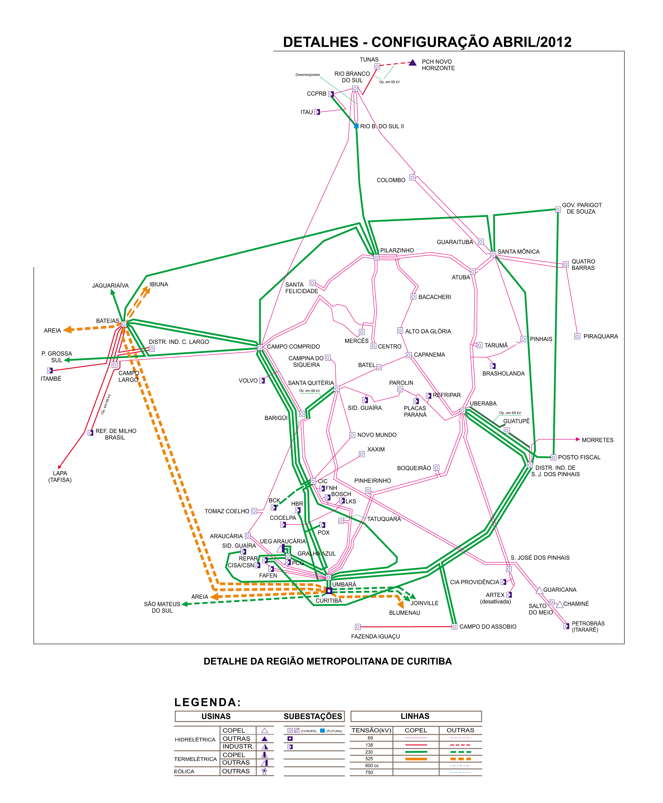
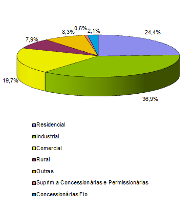

# Estudo de caso

Iniciamos, agora, o estudo do caso propriamente dito -- sendo este o da Companhia Paranaense de Energia. Para um estudo próprio de *valuation*, é necessário conhecer-se o ativo a ser estudado. Isso com a finalidade de poder realizar estimativas de crescimento e risco mais apropriadas, assim como realizar um pequeno dossiê da empresa e suas conquistas, elucidando assim práticas de governança e um histórico operacional.

## Breve dossiê da Copel

Comecemos, desta forma, fazendo um dossiê da empresa, de forma a estudar melhor sua história e operações, assim como expor casos relevantes da empresa.

### História

É de suma importância comentar que a parte a seguir é uma adaptação de transcritos oriundos do site da própria empresa,[^histCopel] com pequenos acréscimos por parte do autor.

[^histCopel]: Versão completa disponível em: <https://www.Copel.com/hpCopel/root/nivel2.jsp?endereco=%2FhpCopel%2Froot%2FpagCopel2.nsf%2Fdocs%2F6505401715872FAA032573FA0069734F>. Último acesso em 10 nov 2020.

A Companhia Paranaense de Energia é a maior empresa do estado do Paraná, tendo sido criada em 26 de outubro de 1954, sob controle acionário do estado do Paraná, abrindo seu capital acionário em abril de 1994 na BM&FBovespa, e tornou-se em julho de 1997 a primeira do setor elétrico brasileiro a ser listada na Bolsa de Valores de Nova Iorque. A marca está também presente, desde junho de 2002, na Comunidade Econômica Europeia, pela Latibex -- o setor latinoamericano da Bolsa de Valores de Madri. A partir de 7 de maio de 2008, a empresa também passou a figurar oficialmente no Nível 1 de Governança Corporativa da BM&FBovespa.

Em 2017, a Companhia atendia diretamente a mais de 4,5 milhões de unidades consumidoras em quase 400 municípios e 1.113 localidades paranaenses. Nesse universo incluem-se 3,6 milhões de lares, 78 mil indústiras, 384 mil estabelecimentos comerciais e 356 mil propriedades rurais. O quadro de pessoal, na época, era integrado por 8.453 empregados.

Sua estrutura compreende a operação de:

-   Parque gerador próprio composto por 30 usinas próprias e 11 participações, cuja potência instalada totaliza 5.675 MW -- a maior parte proveniente de fontes renováveis como hídrica e eólica -- e que responde pela produção de aproximadamente 4% de toda a eletricidade gerada no Brasil.
-   Sistema de transmissão formado por mais de 4 mil km de linhas e 45 subestações automatizadas.
-   Sistema de distribuição com 195 mil km de linhas -- a terceira maior do País -- e 362 subestações automatizadas.

Hoje as usinas, linhas de transmissão e de distribuição da Copel transmitem luz para todo o Paraná e estados vizinhos. Tal cenário de progresso tem sido conquistado ao longo de seis décadas, com base no potencial hidráulico e no domínio tecnológico de seus quadros técnicos e profissionais.

Comentemos, agora, uma breve linha do tempo da Companhia.

Foi criada a Copel -- ainda Companhia Paranaense de Energia Elétrica -- através do Decreto n° 14.947 de 26 de outubro de 1954, assinado por Bento Munhoz da Rocha Neto, na época governador do Paraná. Apenas em 1979 tornou-se Companhia Paranaense de Energia, tendo como base principal para a integralização de seu capital o Fundo Estadual de Eletrificação. Em seguida, em 1956, com o Decreto n° 1.412, a Copel passou a centralizar todas as ações governamentais de planejamento, construção e exploração dos sistemas de produção, transmissão, transformação, distribuição e comércio de energia elétrica e serviços correlatos, tendo incorporado, de forma central, todos os bens, serviços e obras em poder de diversos órgãos. Coube à Companhia, então, ser responsável pela construção dos grandes sistemas de integração enerética e dos empreendimentos hidrelétricos previstos no Plano de Eletrificação do Paraná. Inclusive, no mesmo ano, em 1° de agosto, a Companhia assumiu pela primeira vez o serviço de distribuição de energia de um munícip do estado: Maringá. Na época, Maringá possuía um rápido crescimento demográfico. Ora, com a chegada da Copel e da energia elétrica, o desenvolvimento do municípío acelerou ainda mais. Em seguida, vieram outros municípios.

Durante a década de 60 e 70, pode-se constatar que o maior desafio para a Copel foi encontrar uma solução definitiva para o abastecimento de energia elétrica em larga escala. De fato, iniciaram-se as operações em 1963 da Usina Termelética de Figueira, de fundamental importância para a implantação do Plano Estadual de Eletrificação, viabilizando os sistemas de interligação que beneficiaram as Regiões Norte e Centro. Quatro anos depois, a Copel inaugurava a Usina de Salto Grande do Iguaçu, para atender ao sul do Estado. Entrando na década de 70, entrava em operação a Usina Julio de Mesquita Filho, para abastecer energicamente o oeste e o sudoeste. Um ano após, foi inaugurada a Usina Governador Parigot de Souza, este nome sendo uma homenagem ao governador Pedro Viriato Parigot de Souza, que também tinha sido presidente da Copel. É, atualmente, a maior central subterrânea do sul do Brasil e era a principal unidade geradora da Copel e maior usina em funcionamento no sul do Brasil no momento de sua inauguração, sendo um passo definitivo na constituição de uma infraestrutura energética capaz de suportar o desenvolvimento paranaense.

Nos anos de 1973 e 1974, a Copel deu um salto no número de consumidores ao assumir a distribuição de energia de diversos municípios do Estado. Em 1° de agosto de 1973, a Companhia incorporava a Companhia Força e Luz do Paraná, que atendia Curitiba. Um ano após, em 1° de junho de 1974, a Copel assumiu, também a distribuição de Londrina. Aliado a isso, foi lançado um programa de inclusão elétrica pela empresa, o que contribuiu para levar energia a ainda mais residências. Dessa forma, tivemos em 1981 a marca de 1 milhão de consumidores ligados à rede.

Naturalmente, com tamanha expansão de clientela, seria necessário à empresa expandir sua capacidade energética. Dessa forma, em 1980 foi inaugurada a hidrelétrica Governador Bento Munhoz da Rocha Netto, nomeada em honra ao governador Bento Munhoz da Rocha Netto, governador este que assinou o Decreto para a criação da Companhia. Com essa operação, a geração própria da Copel atingiu 2.9 bi kWh, contra 1.9 bi kWh do ano anterior.

1986 foi um ano de retrospectiva para a Companhia. De fato, ela levou 27 anos (de 1954 a 1981) para alcançar 1 milhão de consumidores, e somente 5 anos para aumentar outros 500 mil. Essa conquista, inclusive, se deu em meio ao racionamento de energia por causa de uma estiagem forte na região. Assim sendo, as décadas seguintes são marcadas por uma expansão exponencial da empresa, assim como um aumento das obras para se expandir a capacidade energética.

Em setembro de 1992, foi concluída a Usina Hidrelétrica Governador Ney Aminthas de Barros Braga. Contribuiu para reduzir a dependência paranaense de energia comprada de outros Estados. Foi, inclusive, a primeira usina hidrelétrica a ter um Relatório de Impacto Ambiental (RIMA). Em fevereiro de 1999, entra em operação a Usina Hidrelétrica Governador José Richa.

Em 2004, a Copel completou 50 anos de existência. Apenas dois anos antes, foi anunciado o cancelamento do processo de privatização da Companhia, iniciado em 1998. Com o passar dos anos, a empresa se tornou expoente no que tange a P&D do setor elétrico, com diversas inovações. Nota-se, por exempo, o marco do funcionamento da primeira célula a combustível a operar no Hemisfério Sul, em 2001, para suprir o CPD da Copel. Houve também a automação da subestação Jardim Tropical, fazendo com que a empresa sae tornasse a primeira do setor elétrico brasileiro a automatizar todas as subestações de transmissão.

A empresa inaugura, em 2 anos, 2 novas hidreléticas: a de Santa Clara e a do Fundão. No meio tempo da construção de outra usina, ambas Santa Clara e Fundão recebem autorização da ONU e tornam-se as primeiras hidreléticas do Brasil a poderem comercializar certificados de Créditos de Carbono. De fato, existem duas outras usinas com planos de construção, a de Mauá e a Colíder, demonstrando assim a demanda de expansão da Companhia.

Em 2012, a Copel finalizou todas as fases do programa Luz para Todos, efetivamente conquistando a universalização do fornecimento de energia elétrica no Paraná. O reconhecimento foi formalizado pela ANEEL, marcando assim o início de uma era sob motivação de modernização e automação das redes de energia por parte da empresa. Três anos após, em janeiro, a Copel institui uma empresa de comercialização para atuar no Mercado Livre, atuando assim na compra e venda de energia, além de consultoria. A partir de 2016, a empresa volta seus esforços para além do Paraná, com entradas de operação em linhas de transmissão de conectam o Paraná ao Mato Grosso e um no Maranhão.

Podemos notar, então, um grau de maturidade elevado por parte da empresa atualmente, em que a mesma segue uma motivação de melhoria dos processos atuais, com objetivo secundário de ampliar para outros estados, à medida que concessões e órgãos reguladores dão seu aval.

### *Core business*

As informações retiradas para o estudo do *core business* da Copel foram retiradas diretamente do site deles.[^siteCopel]

[^siteCopel]: Disponível em: <https://www.Copel.com/hpcweb/>. Último acesso em 20 nov 2020.

#### Geração

A Copel opera um parque gerador com diversas usinas próprias e participações societárias, em um leque diversificado de fontes energéticas, indo de biomassa a solar. A geração é supervisionada e coordenada pelo Centro de Operação de Geração e Transmissão da empresa, sediado em Curitiba.

```{r, fig.cap = "Usinas da Copel localizadas em mapa do Paraná.", fig.pos = "H", echo = FALSE, out.width = "100%"}
knitr::include_graphics("img/usinas_Copel.jpg")
```

Comecemos comentando a respeito das hidrelétricas. Existe uma diferenciação entre Central Geradora Hidrelétrica (CGH), Pequena Central Hidrelétrica (PCH) e Usina Hidrelétrica (UHE). Por mais que todas se aproveitem do potencial hidráulico de um recurso hídrico, a diferença está no porte do empreendimento. Como disposto pela ANEEL, na Resolução n° 875, de 10 de março de 2020,[^res875] a diferenciação é tal:

[^res875]: Disponível em: <https://www.in.gov.br/web/dou/-/resolucao-normativa-n-875-de-10-de-marco-de-2020-248070610>. Último acesso em 17 nov 2020.

-   Uma **Central Geradora Hidrelétrica com Capacidade Instalada Reduzida (CGH)** é aquela cuja potência seja igual ou inferior a 5 MW.
-   Uma **Pequena Central Hidrelétrica (PCH)** é aquela que possuem duas características: (1) potência instalada superior a 5 MW e igual ou inferior a 30 MW; e (2) área de reservatório de até 13 km², excluindo a calha do leito regular do rio. Existem, ainda, cláusulas que regularizam a condição de (2).
-   Uma **Usina Hidrelétrica (UHE)** é aquela que possui quaisquer uma das seguintes características: (1) potência instalada superior a 5 MW e igual ou inferior a 50 MW, desde que não sejam enquadrados como PCH e estejam sujeitos à outorga de autorização; (2) potência instalada superior a 50 MW, sujeitos à outorga de concessão; ou (3) independente da potência instalada, tenham sido objeto de outorga de concessão ou de autorização.

Essa diferenciação é relevante, uma vez que o licenciamento destes três tipos de empreendimento ocorre de forma diferenciada. Isso decorre do fato que a extensão dos impactos ambientais provocados pelas CGHs, PCHs e UHEs são, também, diferenciados.

Assim sendo, são as hidrelétricas tanto operacionais quanto em construção, com participação da Copel:

-   **UHE Colíder.** Está sendo construída na região norte do Mato Grosso, nos municípios de Nova Canaã do Norte e Itaúba. O empreendimento terá potência instalada estimada de 300 MW, o suficiente para atender ao consumo de uma cidade com 850 mil habitantes. Cabe comentar que essa obra é integrante do PAC do Governo Federal.
-   **UHE Governador Ney Aminthas de Barros Braga,** anterior UHE Segredo. Esta é a segunda usina da Copel em potência instalada, com capacidade de 1.260 MW. Está localizada no rio Iguaçu, no município de Mangueirinha. Foi inaugurada em 1992, tendo sido a primeira UHE a possuir um Relatório de Impacto Ambiental (Rima) no Brasil.
-   **UHE Governador José Richa,** anterior UHE Salto Caxias. É uma das mais importantes da Copel, tendo 1.240 MW de potência instalada. Foi inaugurada em fevereiro de 1999 e está situada no rio Iguaçu, no município de Capitão Leônidas Marques.
-   **UHE Governador Bento Munhoz da Rocha Netto,** anterior UHE Foz do Areia. Esta é a maior usina da Copel, com capacidade instalada de 1.676 MW. Está localizada no rio Iguaçu, no município de Pinhão. Como um todo, a operação foi iniciada em 1980; suas operações causaram a desativação da PCH Salto Grande do Iguaçu, que contava com 15.2 MW.
-   **UHE Baixo Iguaçu.** Tem capacidade instalada de 350,2 MW -- suficiente para atender uam cidade com 1 milhão de habitantes. Iniciou suas operações no primeiro semestre de 2019. A Copel detém 30% de participação nesta usina instalada no rio Iguaçu, entre os municípios de Capanema e Capitão Leônidas Marques.
-   **UHE Governador Pedro Viriato Parigot de Souza,** anterior UHE Capivari-Cachoeira. Possui potência de 260 MW, estando situada no município de Antonina, com reservatório localizado no município de Campina Grande do Sul. Entrou em operação em 1970, embora tenha sido inaugurada oficialmente em 26 de janeiro de 1971. Ela é a maior central subterrânea do sul do país.
-   **UHE Dona Francisca.** Com potência instalada de 125 MW, a Copel detém participação de 23,03% no capital social da Dona Francisca Energética S/A (Dfesa). Foi inaugurada em maio de 2001.
-   **UHE Santa Clara.** Tem potência instalada de 120 MW, com garantia física de 69,6 MW médios. Está localizada entre os municípios de Candói e Pinhão, no rio Jordão. Conta, ainda, com uma PCH de potência 3,6 MW e garantia de 2,79 MW médios.
-   **UHE Fundão.** Possui potência instalada de 120 MW, com garantia física de 65,8 MW médios. Está localizada próximo ao município de Pinhão. Conta, ainda, com uma PCH de potência 2,5 MW e garantia de 2,11 MW médios.
-   **UHE Guaricana.** Possui potência de 36 MW. Localize-se na margem esquerda do rio Arraial, no município de Guaratuba. A usina foi adquirida pela Copel quando houve a incorporação da Cia. Força e Luz do Paraná, embora tenha sido inaugurada em 1957.
-   **UHE Derivação do Rio Jordão.** Foi inaugurada em dezembro de 1997, com potência de 6,5 MW. Está localizada no município de Reserva do Iguaçu.
-   **PCH São Jorge.** Possui capacidade instalada de 2,3 MW e está localizada à margem esquerda do rio Pintagui, numa região denominada Alagados. A usina foi inaugurada em 1945, na época pertencendo à Companhia Prada de Eletricidade S.A.; apenas em dezembro de 1974 foi incorporada pela Copel.
-   **PCH Apucaraninha.** Tem capacidade instalada de 10 MW. Foi inaugurada em 1949, pela Empresa Elétrica de Londrina S.A., e incorporada pela Copel em 1974. Está localizada no município de Tamarana, na margem direita do rio Apucaraninha.
-   **PCH Arturo Andreoli,** também conhecida como PCH Foz do Chopim. A Copel detém 35,77% de participação societária da Foz do Chopim Energética Ltda., empresa constituída para exploração da PCH. Tem potência total instalada de 29,1 MW, e a usina como um todo entrou em operação comercial em novembro de 2001.
-   **PCH Chaminé.** Possui capacidade instalada de 18 MW, e está localizada na margem esquerda do rio São João, no município de São José dos Pinhais. Foi construída pela Cia. Força e Luz do Paraná, começando a operar em 1930. Foi incorporada pela Copel em 1975.
-   **PCH Cavernoso.** Esta possui a potência de 1,3 MW. Está localizada na margem direita do rio Cavernoso no município de Virmond. Interessantemente, ela opera a fio d'água, significando que a geração é feita apenas através da vazão normal do rio. Foi construída no final da década de 50 pelo DNAEE e pela prefeitura de Laranjeiras do Sul; entretanto foi inaugurada em 1965, quando foi incorporada pela Copel e teve sua capacidade ampliada.
-   **PCH Cavernoso II.** Tem capacidade instalada de 19 MW, com garantia física de 10,6 MW médio. Foi construída no rio Cavernoso, entre os municípios de Virmond e Candói. A Central entrou em operação comercial a plena capacidade em 4 de julho de 2013.
-   **PCH Chopim I.** Tem potência instalada de 1,98 MW e está localizada na margem esquerda do rio Chopim, no município de Itapejara d'Oeste. Foi a primeira usina construída pela Copel, durante a concepção do primeiro plano de eletrificação do Paraná. A operação começou em 1963.
-   **PCH Bela Vista.** Está sendo instalada no rio Chopim, entre os municípios de Verê e São João, no sudoeste paranaense. O empreendimento recebeu do Instituto Ambiental do Paraná a Licença de Instalação nº 23.569, no dia 10 de maio de 2019. Quando estiver pronta, Bela Vista terá potência instalada de 29 MW e produzirá energia elétrica suficiente para atender até 100 mil pessoas.
-   **CGH Salto do Vau.** Possui potência instalada de 0.94 MW e está localizada na margem esquerda do rio Palmital, no município de União da Vitória. Foi inaugurada em 1959, quando começou a operar. Foi construída pela empresa Alexandre Schlemm e incorporada pela Copel em novembro de 1973.
-   **CGH Pitangui.** Possui 0,87 MW de potência e está localizada na margem esquerda do rio Pitangui, a 12 km de Ponta Grossa. Foi construída por outra empresa em 1911, mas finalmente incorporada pela Copel em 1974.
-   **CGH Melissa.** Possui capacidade de 1 MW de potência instalada e situa-se no município de Corbélia, à margem direita do rio Melissa. Efetivamente, sua operação iniciou-se em 1969, embora tenha sido pausada para uma reforma geral durante a implantação dos equipamentos que a tornaram automatizada em 1994. Retomou, então, a operação no segundo semestre de 1995.
-   **CGH Marumbi.** Possui uma capacidade de 4,8 MW de potência em duas unidades geradores, e está localizada no município de Morretes, à margem direita do rio Ipiranga. Foi inaugurada em abril de 1961, construída pela RFFSA. Em razão do Plano Nacional de Desestatização, por não se enquadradar nas atividades da RFFSA, a usina foi adquirida pela Copel em novembro de 1997.

No que tange a usinas termelétricas, a Copel possui:

-   **UTE Figueira.** Conta com capacidade instalada dae 20 MW, e funciona a base carvão mineral extraído em jazidas da região. A aquisicação da usina foi feita pela Copel em 1969, com posterior instalação de um terceiro grupo gerador, em 1974.
-   **UTE Araucária.** Com capacidade instalada de 484,5 MW, se faz valer de um ciclo combinado de turbina a gás/turbina a vapor para dispor energia. A usina entrou em operação em 2006 para atender ao SIN, em face da severa estiagem ocorrida no início do seguneto semestre do ano.

Vale comentar, entretanto, que a capacidade instalada das UTEs não deve ser tratada como algo sob "uso constante", como é o caso de UHEs, por exemplo. De fato, as UTEs servem atualmente mais como um mecanismo de segurança do sistema energético do que um método de produção regular, pelo alto custo da energia, assim como os problemas relativos à poluição e gases do efeito estufa [@rosa2007].

Finalmente, no que tange a energia eólica, a Copel conta com:

-   **EOL Palmas.** É composta por cinco aerogerados de 500 kW cada, totalizando assim 2,5 MW de potência instalada. Está situada no município de Palmas, ao sul do Paraná. Foi a primeira eólica da região sul do Brasil. Entrou em operação em fevereiro de 1999, mas apenas em 2008 a Copel deteve adquiriu total controle da empresa responsável pela usina, a Centrais Eólicas do Paraná.
-   **Complexo Eólico São Bento Energia.** Está localizado nos municípios de Pedra Grande e São Bento do Norte -- no Rio Grande do Norte. Tem 94 MW de potência instalada.
-   **Complexo Eólico Brisa Potiguar.** Está localizado nos municípios de Parazinho, João Câmara e Touros -- no Rio Grande do Norte. Tem 183,6 MW de potência instalada.
-   **Complexo Eólico Cutia.** Está localizado nos municípios de Pedra Grande e São Bento do Norte -- no Rio Grande do Norte. Tem 180,6 MW de potência instalada.
-   **Complexo Eólico Bento Miguel.** Está localizado no município de São Bento do Norte -- no Rio Grande do Norte. Tem 132,3 MW de potência instalada.
-   **Complexo Eólico Voltalia.** Está localizado nos municípios de São Miguel do Gostoso e Touros -- no Rio Grande do Norte. Conta com 108 MW de potência instalada.

Assim sendo, é possível observar que a matriz energética da Copel é diversificada com maior ênfase em hidrelétricas, com recentes desenvolvimentos na construção de parques eólicos, de forma a se aproveitar de Créditos de Carbono e uma fronte de energias mais limpas.

#### Transmissão

Como uma *holding*, a Copel também está presente no setor de transmissão de energia elétrica. De fato, referente a junho de 2016, a Copel possuía 2.521,2 km de linhas e 35 subestações, somando 13.002 MVA de potência de transformação.

As tabelas abaixo apresentam o dimensionamento dos ativos de transmissão da Copel relativos à Rede Básica, para o período de junho de 2016. Cabe comentar que todas as subestações são inteiramente automatizadas.

```{r, tab.pos = "H", echo = FALSE, message = FALSE}
library(tidyverse)
library(knitr)
library(kableExtra)

kable(
  tibble(
    `NÍVEL DE TENSÃO (kV)` = c(69, 138, 230, 525),
    `EXTENSÃO (km)` = c(0, 7.2, 2235.5, 278.5)
  ),
  caption = "Extensão de linhas de transmissão da Copel, por nível de tensão.",
  format = "latex",
  booktabs = TRUE,
  align = "cc"
  ) %>%
  kable_styling(
    latex_options = "HOLD_position"
  ) %>%
  add_header_above(
    header = c("LINHAS DE TRANSMISSÃO" = 2), 
    bold = TRUE
  )
```

```{r, tab.pos = "H", echo = FALSE, message = FALSE}
library(tidyverse)
library(knitr)
library(kableExtra)

kable(
  tibble(
    `NÍVEL DE TENSÃO (kV)` = c(230, 525),
    `QUANTIDADE` = c(31, 4),
    `POTÊNCIA (MVA)` = c(9602.0, 3400.0)
  ),
  caption = "Subestações de transmissão da Copel, por nível de tensão.",
  format = "latex",
  booktabs = TRUE,
  align = "ccc"
  ) %>%
  kable_styling(
    latex_options = "HOLD_position"
  ) %>%
  add_header_above(
    header = c("SUBESTAÇÕES DE TRANSMISSÃO" = 3), 
    bold = TRUE
  )
```

<!--
Essa coisa eh so pra dar o espaco e a formatacao voltar ao normal
-->
$\,$

É possível, também, observar essa extensão geograficamente, através de mapas geoelétricos do estado do Paraná e as principais regiões, como Curitiba e Londrina.

```{r, fig.cap = "Mapa geoelétrico do Paraná.", fig.pos = "H", echo = FALSE, out.width = "100%"}
knitr::include_graphics("img/mapa_geoeletrico_parana.jpg")
```

```{r, fig.cap = "Mapa geoelétrico de Curitiba.", fig.pos = "H", echo = FALSE, out.width = "100%"}

```

```{r, fig.cap = "Mapa geoelétrico de Londrina.", fig.pos = "H", echo = FALSE, out.width = "100%"}
knitr::include_graphics("img/mapa_geoeletrico_londrina.jpg")
```

```{r, fig.cap = "Mapa geoelétrico de Maringá.", fig.pos = "H", echo = FALSE, out.width = "100%"}
knitr::include_graphics("img/mapa_geoeletrico_maringa.jpg")
```

```{r, fig.cap = "Mapa geoelétrico de Ponta Grossa.", fig.pos = "H", echo = FALSE, out.width = "100%"}
knitr::include_graphics("img/mapa_geoeletrico_ponta_grossa.jpg")
```

Por mais que a Companhia possua projetos de transmissão em andamento -- como, por exemplo, as LT Baixo Iguaçu - Realeza e Londrina - Assis --, ela também atua em consultoria e engenharia de linhas de transmissão e subestações. De fato, a engenharia de linhas de transmissão oda Copel é certiicada pela ISO 9001 e atua em seminários, comitês técnicos, treinamentos e pequisas em áreas avançadas. A experiência da empresa no setor foi utilizada em cercad e 7,6 mil km de linhas, implantadas com baixo custo e alta qualidade. A rede básica da empresa, no final das contas, conta com aproximadamente 5,4 mil km de cabos para-raios com fibras óticas -- de tecnologia OPGW, _Optical Ground Wire._ Relativo à engenharia de subestações, a Copel elabora projetos de subestações nas tensões de 69, 138, 230 e 525 kV; gerencia projetos de subestações, elabora especificações de mateirias e equipamentos para subestações, dimensiona sistemas de aterramento, gerencia a construção; e calcula custos e realiza orçamentos para subestações.

#### Distribuição

No que tange a distribuição, a Copel é responsável pela energia de cerca de 4,5 milhões de clientes de 394 municípios do Paraná -- sendo 392 integralmente atendidos e 2 parcialmente. A empresa administra 190 mil km de redes de distribuição, com 2,8 milhões de postes e 361 subestações, assim como potência instalada de 10,5 mil MVA. Todos os dados são referentes ao final do ano de 2019. A empresa conta, também, com postos de atendimento espalhados por todos os municípios da área de concessão.

```{r, tab.pos = "H", echo = FALSE, message = FALSE}
library(tidyverse)
library(knitr)
library(kableExtra)

kable(
  tibble(
    `Classes` = c("Residencial", "Industrial", "Comercial", "Rural", "Outras"),
    `set-19` = c(3808, 73, 405, 351, 58),
    `set-18` = c(3732, 74, 397, 353, 57),
    `%` = c(2.0, -1.4, 2.1, -0.6, 1.2)
  ),
  caption = "Número de consumidores da Copel.",
  format = "latex",
  booktabs = TRUE,
  align = "cccc"
  ) %>%
  kable_styling(
    latex_options = "HOLD_position"
  ) %>%
  add_header_above(
    header = c("Número de consumidores (em milhares)" = 1, "No mês" = 3)
  )
```

```{r, tab.pos = "H", echo = FALSE, message = FALSE}
library(tidyverse)
library(knitr)
library(kableExtra)

kable(
  tibble(
    " " = c("Área de Concessão (km²)", "Municípios Atendidos", "Localidades Atendidas", "População Atendida PR (Mil Habitantes)", "Taxa de Atendimento Urbana (%)", "Consumo Médio Residencial (kWh/mês)"),
    "set/19" = c(194854, 393, 113, 11434, 99.9, 167.5)
  ),
  caption = "Indicadores de atuação da distribuição.",
  format = "latex",
  booktabs = TRUE,
  align = "cc"
  ) %>%
  kable_styling(
    latex_options = "HOLD_position"
  )
```

O perfil de consumo de energia da empresa é diversificado, com a classe Industrial sendo a maior de todas as fatias.

```{r, tab.pos = "H", echo = FALSE, message = FALSE}
library(tidyverse)
library(knitr)
library(kableExtra)

kable(
  tibble(
    `Classes` = c("Residencial", "Industrial", "Comercial", "Rural", "Outras", "Suprim. a Concessionárias e Permissionárias", "Concessionárias Fio"),
    `set-19` = c(5571, 8451, 4509, 1817, 1895, 146, 483),
    `set-18` = c(5413, 8422, 4330, 1791, 1856, 222, 369),
    `%` = c(2.9, 0.3, 4.1, 1.5, 2.1, -34.5, 30.9)
  ),
  caption = "Perfil de consumo de energia da distribuição.",
  format = "latex",
  booktabs = TRUE,
  align = "cccc"
  ) %>%
  kable_styling(
    latex_options = "HOLD_position"
  ) %>%
  add_header_above(
    header = c("Consumo de Energia Acumulado - GWh" = 4),
    bold = TRUE
  )
```

```{r, fig.cap = "Gráfico dos perfis de consumo da distribuição.", fig.pos = "H", echo = FALSE, out.width = "100%"}
knitr::include_graphics("img/consumo_dist.png")
```

Dentro da classe Industrial, temos ainda subdivisões por atividade, com a fabricação de celulose e alimentos compondo quase metade do consumo como um todo.

```{r, tab.pos = "H", echo = FALSE, message = FALSE}
library(tidyverse)
library(knitr)
library(kableExtra)

kable(
  tibble(
    `Descrição` = c("Fabricação de Produtos Alimentícios", "Fabricação de Celulose, Papel e Produtos de Papel", "Fabricação de Produtos Minerais Não Metálicos", "Fabricação de Produtos de Borracha e de Material Plástico", "Fabricação de Produtos Químicos", "Demais Ramos"),
    `set-19` = c(2840, 1113, 615, 510, 491, 2882),
    `set-18` = c(2715, 1181, 716, 492, 443, 2875),
    `%` = c(4.6, -5.8, -14.1, 3.6, 11.1, 0.2)
  ),
  caption = "Perfil de consumo de energia da classe Industrial.",
  format = "latex",
  booktabs = TRUE,
  align = "cccc"
  ) %>%
  kable_styling(
    latex_options = "HOLD_position"
  ) %>%
  add_header_above(
    header = c("Consumo de Energia Acumulado - GWh" = 4),
    bold = TRUE
  )
```

```{r, fig.cap = "Gráfico dos perfis de consumo da classe Industrial.", fig.pos = "H", echo = FALSE, out.width = "100%"}

```

A Copel disponibiliza também os dados referentes às tarifas pagas pelos clientes, tanto de alta quanto baixa tensão.[^justTarifas]

[^justTarifas]: É importante ressaltar que as tarifas já esão disponibilizadas com os impostos (ICMS, PIS e COFINS), vigentes a partir de 09 jul 2020; foram inclusos para facilitar o entendimento por parte do leitor, no entanto, as alíquotas efetivas referentes ao PIS e à COFINS devem ser apuradas mensalmente, com suas variações sendo aplicadas às tarifas tempestivamente.

```{r, tab.pos = "H", echo = FALSE, message = FALSE}
library(tidyverse)
library(knitr)
library(kableExtra)

kable(
  tibble(
    `Descrição` = c("B1 - Baixa Renda, até 30 kWh", "B1 - Baixa Renda, entre 31 e 100 kWh", "B1 - Baixa Renda, entre 101 e 220 kWh", "B1 - Baixa Renda, superior a 220 kWh", "B1 - Residencial", "B2 - Cooperativa de Eletrificação Rural", "B2 - Irrigação e Aquicultura em horário especial", "B2 - Rural", "B2 - Serviço Público de Irrigação Rural", "B3 - Água, Esgoto e Saneamento", "B3 - Demais Classes", "B3 - Poder Público Estadual", "B4A - Iluminação Pública", "B4B - Iluminação Pública"),
    `Convencional.TE` = c(0.09441, 0.23076, 0.34614, 0.38460, 0.3846, 0.30066, 0.12615, 0.31537, 0.29229, 0.34998, 0.38460, 0.26973, 0.21153, 0.23076),
    `Convencional.TUSD` = c(0.06628, 0.16201, 0.24301, 0.27001, 0.36837, 0.28797, 0.12083, 0.30207, 0.27996, 0.33522, 0.36837, 0.25835, 0.20260, 0.22103),
    `Branca.FP.TE` = c(0, 0, 0, 0, 0.36533, 0.28559, 0.11982, 0.29956, 0.27765, 0.33245, 0.36533, 0.25622, 0, 0),
    `Branca.FP.TUSD` = c(0, 0, 0, 0, 0.27639, 0.21606, 0.09065, 0.22664, 0.21006, 0.26347, 0.28953, 0.20306, 0, 0),
    `Branca.I.TE` = c(0, 0, 0, 0, 0.36533, 0.28559, 0.29956, 0.29956, 0.27765, 0.33245, 0.36533, 0.25622, 0, 0),
    `Branca.I.TUSD` = c(0, 0, 0, 0, 0.53043, 0.41465, 0.43495, 0.43495, 0.40313, 0.51855, 0.56984, 0.39965, 0, 0),
    `Branca.P.TE` = c(0, 0, 0, 0, 0.36533, 0.28559, 0.29956, 0.29956, 0.27765, 0.33245, 0.36533, 0.25622, 0, 0),
    `Branca.P.TUSD` = c(0, 0, 0, 0, 0.78446, 0.61325, 0.64326, 0.64326, 0.59618, 0.77365, 0.85016, 0.59625, 0, 0)
  ),
  caption = "Tarifas aplicadas ao Grupo B.",
  format = "latex",
  booktabs = TRUE,
  col.names = NULL,
  align = "ccc|cc|cc|cc"
  ) %>%
  kable_styling(
    latex_options = c("HOLD_position", "scale_down")
  ) %>%
  add_header_above(
    header = c(" " = 1, "TE" = 1, "TUSD" = 1, "TE" = 1, "TUSD" = 1, "TE" = 1, "TUSD" = 1, "TE" = 1, "TUSD" = 1)
  ) %>%
  add_header_above(
    header = c(" " = 3, "Fora de Ponta" = 2, "Intermediário" = 2, "Ponta" = 2)
  ) %>%
  add_header_above(
    header = c(" " = 1, "Convencional" = 2, "Branca" = 6),
    bold = TRUE
  )
```

```{r, tab.pos = "H", echo = FALSE, message = FALSE}
library(tidyverse)
library(knitr)
library(kableExtra)

kable(
  tibble(
    `Grupo` = c("A1", "A2", "A3", "A3", "A3a", "A3a", "A3a", "A3a", "A3a", "A3a", "A3a", "A3a", "A3a", "A4", "A4", "A4", "A4", "A4", "A4", "A4", "A4", "A4", "AS", "AS", "AS", "AS"),
    `Modalidade` = c("Azul", "Azul", "Azul", "Azul - Poder Público Estadual", "Azul", "Azul - Cooperativas Autorizadas", "Azul - Poder Público Estadual", "Azul - Rural", "Verde", "Verde - Aquicultura e Irrigação em Horário Especial", "Verde - Cooperativas Autorizadas", "Verde - Poder Público Estadual", "Verde - Rural", "Azul", "Azul - Cooperativas Autorizadas", "Azul - Poder Público Estadual", "Azul - Rural", "Verde", "Verde - Aquicultura e Irrigação em Horário Especial", "Verde - Cooperativas Autorizadas", "Verde - Poder Público Estadual", "Verde - Rural", "Azul", "Azul - Poder Público Estadual", "Verde", "Verde - Poder Público Estadual"),
    `FP.Demanda.TUSD` = c(6.21, 9.19, 10.65, 7.47, 22.41, 16.76, 15.72, 21.06, 22.41, 22.41, 16.75, 15.72, 21.06, 22.41, 16.83, 15.72, 21.06, 22.41, 22.41, 16.83, 15.72, 21.06, 22.73, 15.94, 22.73, 15.94),
    `FP.Consumo.TE` = c(0.36533, 0.36533, 0.36533, 0.25622, 0.36533, 0.27323, 0.25622, 0.34341, 0.36533, 0.10960, 0.27323, 0.25622, 0.34341, 0.36533, 0.27433, 0.25622, 0.34341, 0.36533, 0.10960, 0.27433, 0.25622, 0.34341, 0.36533, 0.25622, 0.36533, 0.25622),
    `FP.Consumo.TUSD` = c(0.07884, 0.08712, 0.08816, 0.06183, 0.11436, 0.08553, 0.08021, 0.10750, 0.11436, 0.03431, 0.08553, 0.08021, 0.10750, 0.11436, 0.08587, 0.08021, 0.10750, 0.11436, 0.03431, 0.08587, 0.08021, 0.10750, 0.15601, 0.10941, 0.15601, 0.10941),
    `P.Demanda.TUSD` = c(6.52, 22.35, 24.23, 16.99, 50.35, 37.66, 35.31, 47.33, 22.41, 22.41, 16.75, 15.72, 21.06, 50.35, 37.81, 35.31, 47.33, 22.41, 22.41, 16.83, 15.72, 21.06, 98.93, 69.38, 22.73, 15.94),
    `P.Consumo.TE` = c(0.59656, 0.59656, 0.59656, 0.41839, 0.59656, 0.44617, 0.41839, 0.56077, 0.59656, 0.59656, 0.44617, 0.41839, 0.56077, 0.59656, 0.44796, 0.41839, 0.56077, 0.59656, 0.59656, 0.44796, 0.41839, 0.56077, 0.59656, 0.41839, 0.59656, 0.41839),
    `P.Consumo.TUSD` = c(0.07884, 0.08712, 0.08816, 0.06183, 0.11436, 0.08553, 0.08021, 0.10750, 1.33891, 1.33891, 1.00137, 0.93903, 1.25858, 0.11436, 0.08587, 0.08021, 0.10750, 1.33891, 1.33891, 1.00539, 0.93903, 1.25858, 0.15601, 0.10941, 2.56357, 1.79793)
  ),
  caption = "Tarifas aplicadas ao Grupo A.",
  format = "latex",
  booktabs = TRUE,
  col.names = NULL,
  align = "ccc|cc|c|cc"
  ) %>%
  column_spec(2, width = "8em") %>%
  kable_styling(
    latex_options = c("HOLD_position")
  ) %>%
  add_header_above(
    header = c("Grupo" = 1, "Modalidade" = 1, "TUSD" = 1, "TE" = 1, "TUSD" = 1, "TUSD" = 1, "TE" = 1, "TUSD" = 1)
  ) %>%
  add_header_above(
    header = c(" " = 2, "Demanda" = 1, "Consumo" = 2, "Demanda" = 1, "Consumo" = 2)
  ) %>%
  add_header_above(
    header = c(" " = 2, "Fora de Ponta" = 3, "Ponta" = 3),
    bold = TRUE
  ) %>%
  footnote(general = "Demanda e Consumo medidos, respectivamente, em R$/kW e R$/kWh.",
           general_title = "Nota: ",
           title_format = "italic",
           footnote_as_chunk = T)
```

## Cálculo do *valuation* intrínseco

### O custo de capital médio ponderado (WACC)

#### Custo de capital próprio

#### Custo de capital de terceiros

#### Fluxo de caixa descontado

## Cálculo do *valuation* relativo

### Margem bruta

### Lucros antes de juros e impostos (EBIT)

### Margem líquida

### Razão preço/lucro (P/E)

### Retorno sobre patrimônio líquido (ROE)

### Comparação com empresas do setor
