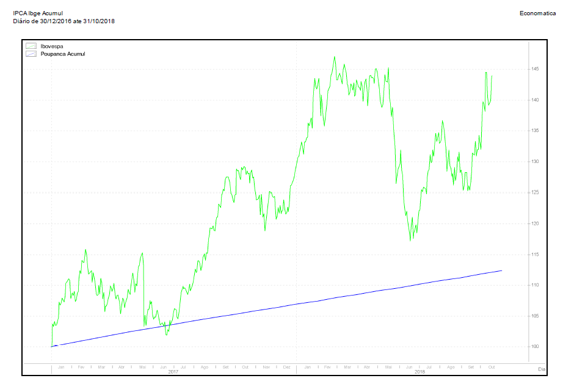

<!--
Above is the YAML (YAML Ain't Markup Language) header that includes a lot of metadata used to produce the document.  Be careful with spacing in this header!

If you'd prefer to not include a Dedication, for example, simply delete the section entirely, or silence (add #) them. 

If you have other LaTeX packages you would like to include, delete the # before header-includes and list the packages after hyphens on new lines.

If you'd like to include a comment that won't be produced in your resulting file enclose it in a block like this.

If you receive a duplicate label error after knitting, make sure to delete the index.Rmd file and then knit again.
-->

```{r include_packages, include = FALSE}
# This chunk ensures that the coppedown package is
# installed and loaded. This coppedown package includes
# the template files for the thesis.
if(!require(devtools))
  install.packages("devtools", repos = "http://cran.rstudio.com")
if(!require(coppedown))
  devtools::install_github("mralbu/coppedown")
library(coppedown)
```

<!-- On ordering the chapter files:
There are two options:
1. Name your chapter files in the order in which you want them to appear (e.g., 01-Inro, 02-Data, 03-Conclusions). 
2. Otherwise, you can specify the order in which they appear in the _bookdown.yml (for PDF only).

Do not include 00(two-hyphens)prelim.Rmd and 00-abstract.Rmd in the YAML file--they are handled in the YAML above differently for the PDF version.
-->

<!-- The {.unnumbered} option here means that the introduction will be "Chapter 0." You can also use {-} for no numbers
on chapters.
-->

# Introdução

## Contextualização

A Bolsa de Valores ganhou uma de suas mais famosas denominações a partir de 1967: Bovespa, a Bolsa de Valores SP. Um ano depois, foi criado o principal índice de ações brasileiro: o Ibovespa. Resumidamente, é uma média ponderada das ações com maior volume de negociação. Após certo tempo, foi criada a CETIP – a Central de Custódia e de Liquidação Financeira de Títulos – em 1984, começando a operar em 1986.

A partir de 2007, as bolsas de valores deixaram de ser entidades sem fins lucrativos e tornaram-se empresas de capital aberto. No ano seguinte, a BM&F e a Bovespa se uniram, resultando na criação da Bolsa de Valores, Mercadorias e Futuros de São Paulo (BM&F Bovespa). Em 2017, são fundidas a BM&F Bovespa e CETIP, dando eram à B3 S.A., sob a supervisão da CVM – esta é a bolsa como a conhecemos.

Em tempos contemporâneos, há um crescimento de CPFs registrados na Bolsa de Valores ano a ano, sendo em 2020 o recorde, um aumento de 33% relativo a 2019 [@valorinveste2020].

Com diversos setores e subsetores de atuação, são diversas as empresas de capital aberto à disposição para escolha do crescente número de investidores brasileiros, sendo o setor utilitário 


## Justificativa

Geralmente, no caso de investidores iniciantes, diversificação de ativos segundo a teoria do portfólio eficiente de Markowitz [-@markowitz1952] é a rota trilhada. Por esse prisma, a compra de fundos de índice (ETFs) possibilita uma significativa diversificação de ativos a preços acessíveis. Efetivamente, replica-se um índice do mercado, possibilitando ao cotista -- o comprador do fundo de índice -- um retorno muito próximo ao mesmo.

Com o passar do tempo, a maturação no mercado financeiro naturalmente pode levar o investidor a se interessar por retornos acima do mercado, fundos de índice impossibilitam o objetivo. Isso leva ações singulares se tornem mais atraentes, tendo em visto que raramente fundos de investimento com administração ativa, no longo prazo, superam os retornos dos fundos de índice [@bogle2015].

Em comparação à poupança, é evidente que o rendimento do IBOV é superior.

```{r ibovpoupanca, echo = FALSE, fig.cap = "Uma comparação entre poupança vs. IBOV, de 2016 a 2018. Fonte: Econometrica", out.width = "100%", fig.pos="H"}

```


Interessantemente, o único período no exposto acima que a poupança superou o IBOV foi nos momentos posteriores ao _Joesley Day_, em 18 de maio de 2017.

falar sobre democratizacao da bolsa (falar sobre bogle e etfs)

Assim sendo, é importante de que as escolhas de ativos seja racional. 
falar sobre a importancia da racionalidade nas escolhas (procurar referencias)

## Objetivos

- fazer o valuation da COPEL via fluxo de caixa descontado e relativo
- fazer uma comparacao dos resultados
- alguma outra coisa

## Limitações

## Estrutura do trabalho
