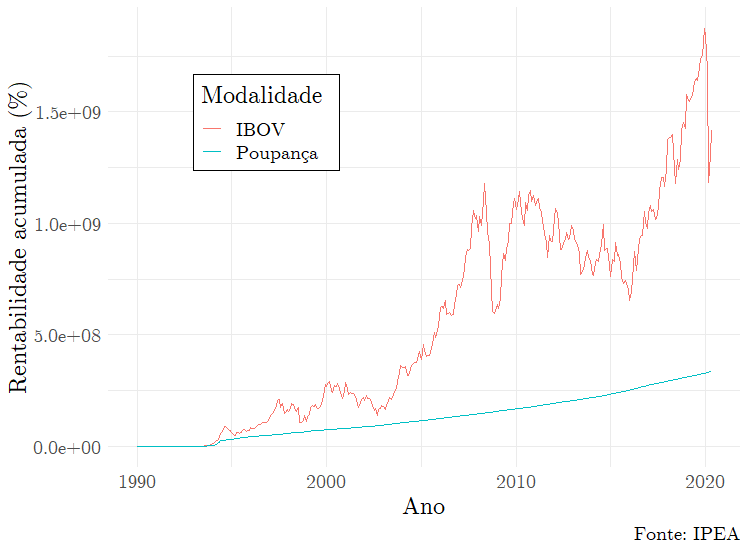

<!--
Above is the YAML (YAML Ain't Markup Language) header that includes a lot of metadata used to produce the document.  Be careful with spacing in this header!

If you'd prefer to not include a Dedication, for example, simply delete the section entirely, or silence (add #) them. 

If you have other LaTeX packages you would like to include, delete the # before header-includes and list the packages after hyphens on new lines.

If you'd like to include a comment that won't be produced in your resulting file enclose it in a block like this.

If you receive a duplicate label error after knitting, make sure to delete the index.Rmd file and then knit again.
-->

```{r include_packages, include = FALSE}
# This chunk ensures that the coppedown package is
# installed and loaded. This coppedown package includes
# the template files for the thesis.
if(!require(devtools))
  install.packages("devtools", repos = "http://cran.rstudio.com")
if(!require(coppedown))
  devtools::install_github("mralbu/coppedown")
library(coppedown)
```

<!-- On ordering the chapter files:
There are two options:
1. Name your chapter files in the order in which you want them to appear (e.g., 01-Inro, 02-Data, 03-Conclusions). 
2. Otherwise, you can specify the order in which they appear in the _bookdown.yml (for PDF only).

Do not include 00(two-hyphens)prelim.Rmd and 00-abstract.Rmd in the YAML file--they are handled in the YAML above differently for the PDF version.
-->

<!-- The {.unnumbered} option here means that the introduction will be "Chapter 0." You can also use {-} for no numbers
on chapters.
-->

# Introdução

Cabe, antes de começar o desenvolvimento do trabalho propriamente dito, contextualizar e justificar o trabalho, assim como explicitar aos leitores os objetivos, as limitações e a estrutura do mesmo.

## Contextualização

É necessário definir Bolsas de Valores, assim como retratar uma breve história da brasileira a partir de 1967 --  ano a partir do qual começou a se chamar Bolsa de Valores de São Paulo, a Bovespa. Segundo Assaf Neto [-@assafneto2018], as Bolsas são entidades, cujo objetivo básico é o de manter um local em condições adequadas para a realização de operações de compra e venda de títulos e valores mobiliários.

Um ano após 1967, foi criado o principal índice de ações brasileiro: o Ibovespa. Resumidamente, este índice é uma média ponderada das ações com maior volume de negociação. Após certo tempo, foi criada a Cetip – a Central de Custódia e de Liquidação Financeira de Títulos – em 1984, começando a operar em 1986.

A partir de 2007, as bolsas de valores deixaram de ser entidades sem fins lucrativos e tornaram-se empresas de capital aberto. No ano seguinte, a BM&F e a Bovespa se uniram, resultando na criação da Bolsa de Valores, Mercadorias e Futuros de São Paulo -- a BM&F Bovespa. Em 2017, são fundidas a BM&F Bovespa e Cetip, dando origem à B3 S.A., sob a supervisão da Comissão de Valores Mobiliários – esta é a bolsa brasileira atualmente.

Em tempos contemporâneos, há um crescimento de CPFs registrados na Bolsa de Valores ano a ano, sendo em 2020 o recorde, um aumento de 47.7% relativo a maio de 2019^[Pode-se conferir a evolução dos mesmos baixando a planilha presente neste link: http://www.b3.com.br/pt_br/market-data-e-indices/servicos-de-dados/market-data/consultas/mercado-a-vista/historico-pessoas-fisicas/. Último acesso em 07 jul 2020.].

Com diversos setores e subsetores de atuação, são diversas as empresas de capital aberto à disposição para escolha do crescente número de investidores brasileiros -- o que não quer dizer que o investidor deve investir em todos. De fato, o investidor precisa minimizar seu risco, preferencialmente investindo em empresas que dentre outras características possuem alto _payout_ de dividendos, baixo grau de alavancagem; e menor variabilidade de lucros [@beaver1970]. 

Empresas do setor de utilidades possuem tais características, em sua maioria; dessa forma, escolheu-se um exemplar do mesmo -- a Companhia Paranaense de Energia, COPEL -- como forma de fazer o valuation da empresa, fazer um breve resumo do setor elétrico, comparar os métodos de avaliação; e, evidentemente, exemplificar o processo ao leitor.

## Justificativa

Por mais que a caderneta de poupança seja o investimento preferido dos brasileiros, segundo a Associação Brasileira das Entidades dos Mercados Financeiro e de Capitais [-@anbima2019] -- esta modalidade conta com 88% da população -- é evidente que o rendimento nominal^[Nominal, pois os retornos reais são contextuais devido ao pagamento de impostos, dividendos; e, a depender do ativo, dos custos do mesmo.] do IBOV é superior no longo prazo. Pelo IPEA, pode-se obter tanto os rendimentos nominais (em % a.m.) da poupança quanto os retornos do IBOV (também em % a.m.), ambos em intervalos mensais desde 1990.^[Ambas as séries podem ser obtidas em http://www.ipeadata.gov.br/Default.aspx. Último acesso em 10 jul 2020.] A partir daí, acumulamos as taxas recursivamente. Definindo $i$ como a taxa de retorno nominal total, e $i_t$ como sendo a taxa de retorno nominal no mês $t$, temos $i = \prod_{t=1}^n (1+i_t),$ sendo $n$ o mês que se deseja calcular o retorno nominal total. Exposto isso, foi feito um gráfico dos retornos totais de ambas as modalidades:

```{r, fig.cap = "Uma comparação entre o IBOV e a poupança.", fig.pos = "H", echo = FALSE, out.width = "100%"}

```

Com o passar do tempo, entretanto, a maturação no mercado financeiro pode, naturalmente, levar o investidor a se interessar por retornos acima do mercado -- fundos de índice, por definição, impossibilitam o objetivo. Isso leva a uma exploração de diferentes classes de ativos, desde ações ordinárias a fundos de investimento em ações. Um investidor, entretanto, há de ter em mente que raramente fundos de investimento com administração ativa, no longo prazo, superam os retornos dos fundos de índice, em termos reais [@bogle2015].

Assim sendo, caso o investidor deseja ter sucesso, é importante que as escolhas de ativos sejam racionais. Ao menos, tão racionais quanto possível forem para humanos. De fato, indivíduos estão sujeitos a uma racionalidade restrita [@simon1997], o que leva a diversas heurísticas -- inclusive, mas não limitadas a: enfatizar evidências que apoiam visões próprias [@klayman1995], superestimar probabilidades por maior "disponibilidade" em memória [@schwarz1991]; e superestimar a própria habilidade, quando se é novato, assim como subestimar, quando se é um _expert_ [@kruger1999] -- para simplificar o processo de raciocínio e, permitir, assim, que o agente consiga satisfazer as restrições -- tempo, recursos, dentre outros -- para a tomada de decisões.

De fato, a abordagem de realizar tanto o _valuation_ intrínseco quanto o relativo de uma empresa é, além de uma interessante comparação entre métodos, uma forma de evitar a "síndrome do homem com martelo", popularizado por Munger [-@munger2006]. Este cita um provérbio, que diz: "Para um homem com um martelo, todo problema se parece com um prego."

## Objetivos

São os principais objetivos do trabalho (1) fazer o _valuation_ da Companhia Paranaense de Energia através de, no mínimo, dois métodos de valuation, sendo no mínimo um deles intrísenco e no mínimo, um relativo e (2) realizar a comparação entre os resultados dos métodos.

Com o desenvolver do trabalho, poderão ser percebidas outras motivações, entretanto seriam estas consideradas secundárias.

## Limitações

Este trabalho se limita a prover um breve prospecto do cenário energético brasileiro, assim como possíveis desenvolvimentos. Não serão discutidas políticas energéticas e afins. Se limita, também, a tomar como verdadeira a teoria moderna do portfólio como exposta por Markowitz [-@markowitz1952], para o cálculo do custo de capital. Não será discutido economia comportamental, nem modelos mais sofisticados para tal cálculo.

## Estrutura do trabalho

O trabalho possui, em sua integridade, cinco capítulos.

O primeiro capítulo é uma introdução ao restante do trabalho, e é efetivamente um resumo do que o leitor verá pela frente.

O segundo capítulo é uma examinação do setor energético brasileiro, a ser feito pela leitura e examinação do Plano Decenal de Expansão de Energia (PDE) e o Plano Nacioanl de Energia (PNE), ambos elaborados pela Empresa de Pesquisa Energética (EPE). Através destes, podemos ter uma melhor noção do setor no qual a empresa está inserido, possibilitando um melhor cálculo e previsão dos fluxos de caixa.

O terceiro capítulo é a documentação do referencial teórico utilizado, a ser escrito seguindo uma lógica linear, de forma tal que possa também ser visto como uma metodologia, com exemplos para auxiliar o leitor.

O quarto capítulo é o estudo de caso de fato. Será dada uma contextualização da empresa, assim como a aplicação dos métodos discutidos.

O quinto e último capítulo é a conclusão, em que será feita a exposição dos resultados, assim como a comparação entre os métodos de _valuation_ discutidos durante o texto.